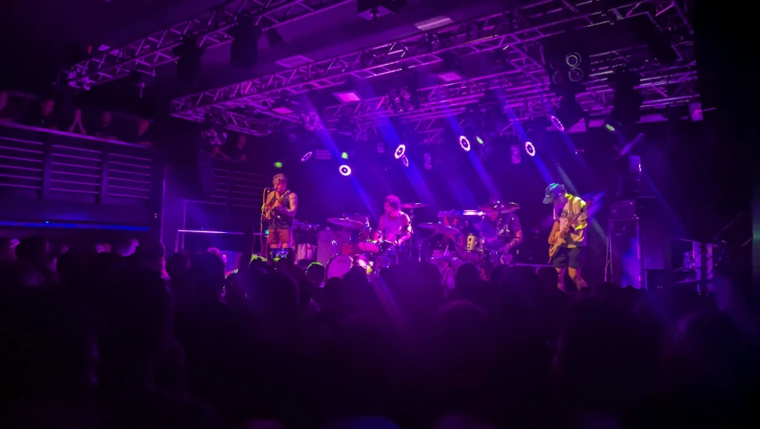
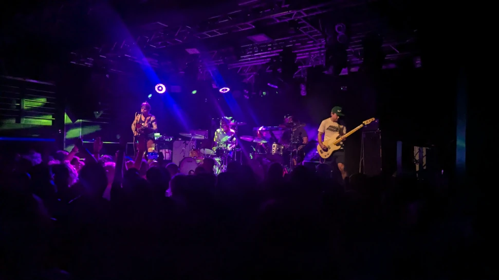
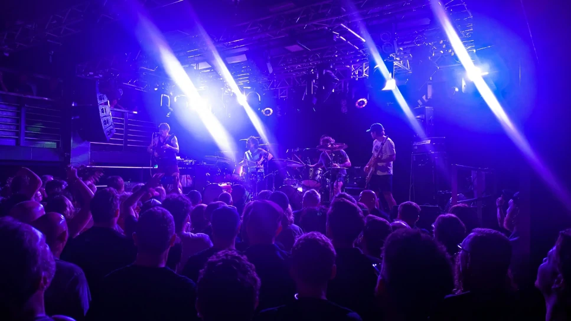
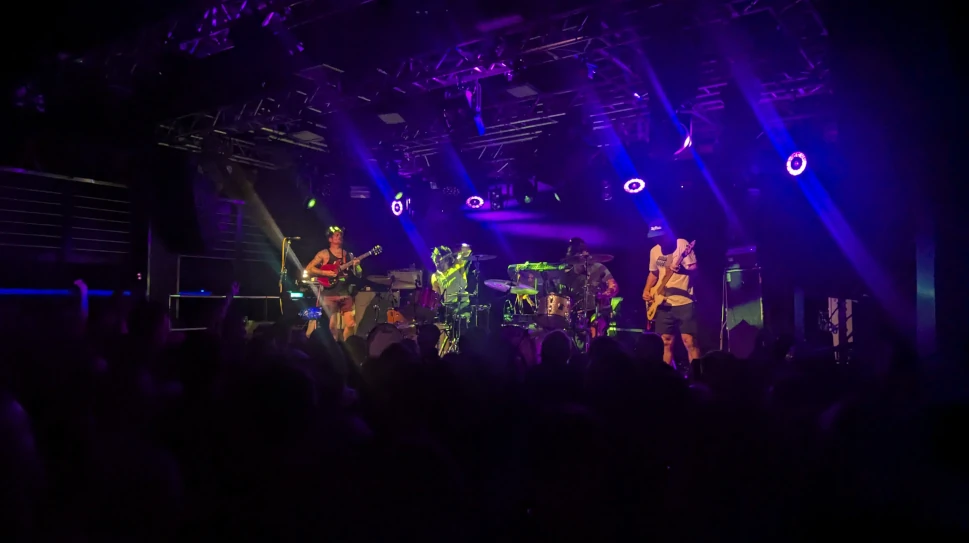
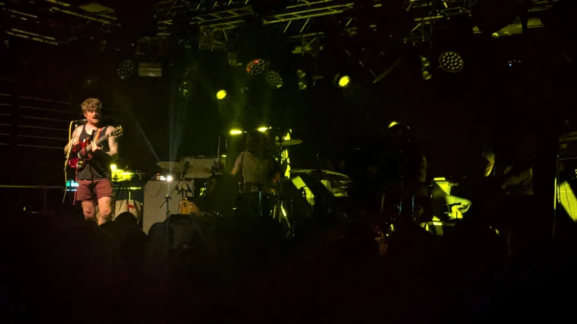
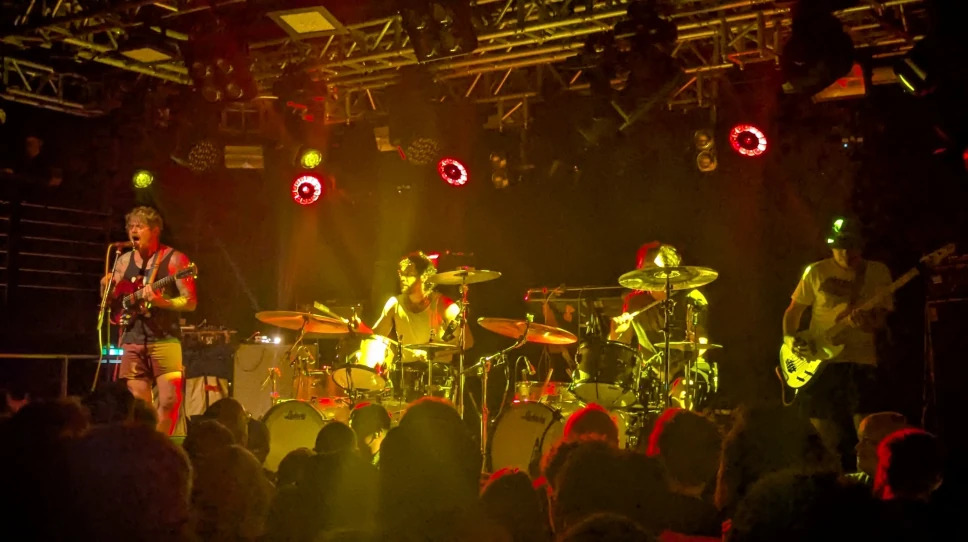
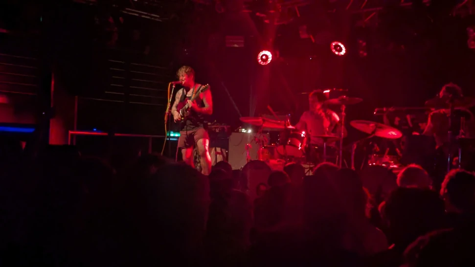
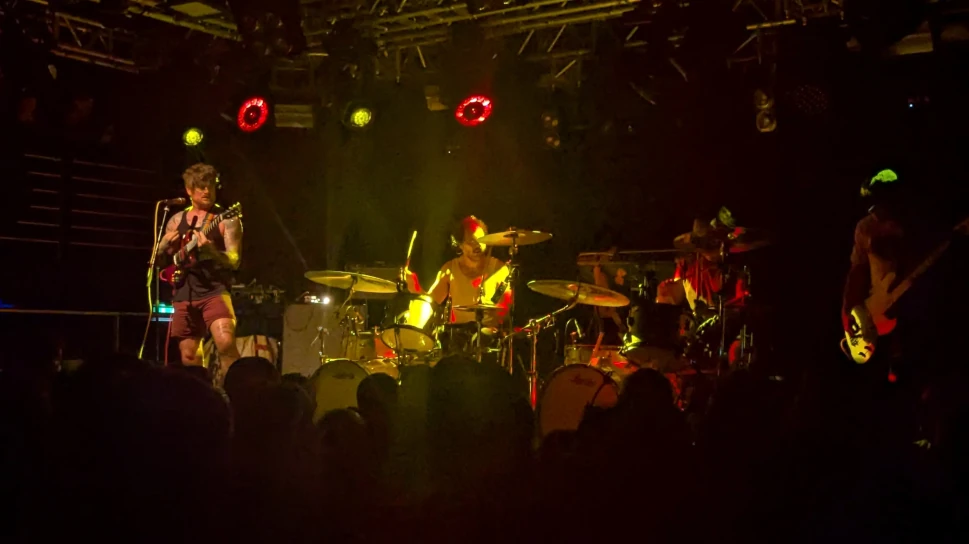

Finished work early and headed down to [The City Cafe](https://www.thecitycafe.co.uk/) for some pre-gig food, I do seem to be developing a habit of going to that restaurant, saying that, it is reasonably priced with good service so what’s not to like.

Ross popped in after his work for a catchup and a few beers before the gig proper (always a pleasure), after putting the world to rights, we headed off to the [Bow Bar](https://pubgallery.co.uk/pubs/bow-bar/) to catch up with [Danny (Gigantics)](https://www.gig-antics.live/) and Logie for some more refreshing beverages. We got there in time for the Osess's first song, geeze it was hot, must have been well over 30c in there, still, the band were totally rockin.

Afterwards we got to talk to some really nice people from Bavaria (now living in Edinburgh), and as you do, we were discussing the differences in culture (apparently no a huge amount), seemingly certain parts of Bavaria are culturally similar to Wales (they were smiling when they said it, so I'll take it as a positive). 😉

If you're not familiar with the Osees's here's a wee snippet of the Wikipedia Bio which describes them better than I could and is bang on point.

> Osees is an American rock band formed in San Francisco, California in 1997, now based in Los Angeles, California.[1] Originally the solo recording project of John Dwyer, the band has evolved through numerous line-up and name changes since its founding, with Dwyer serving as the band leader and primary songwriter throughout. Alongside Dwyer, the band's current line-up includes longtime members, Tim Hellman (bass), Butch Sunset (bongos), Paul Quattrone (drums) and Tomas Dolas (keyboards).
>
> The group's sound draws from a wide variety of influences, including garage rock, krautrock, psychedelia, and folk music. Osees are noted for their prolific recording output, energetic live shows, and whimsical visual aesthetic. The group has released twenty-eight studio albums, to date, alongside various EPs, singles and compilations.

Venue - [The Liquid Rooms](https://www.liquidroom.com/)

## Gig Photos

_The Osees 1_

_The Osees 2_

_The Osees 3_

_The Osees 4_

_The Osees 5_

_The Osees 6_

_The Osees 7_

_The Osees 8_

## References

* The Osees - [Website](https://www.theeohsees.com/)
* The Osees - [Wikipedia Page](https://en.wikipedia.org/wiki/Osees)
* Container - [Bandcamp](https://gentledefect.bandcamp.com/album/creamer)
* Danny Gigantic - [Blog](https://www.gig-antics.live/)
