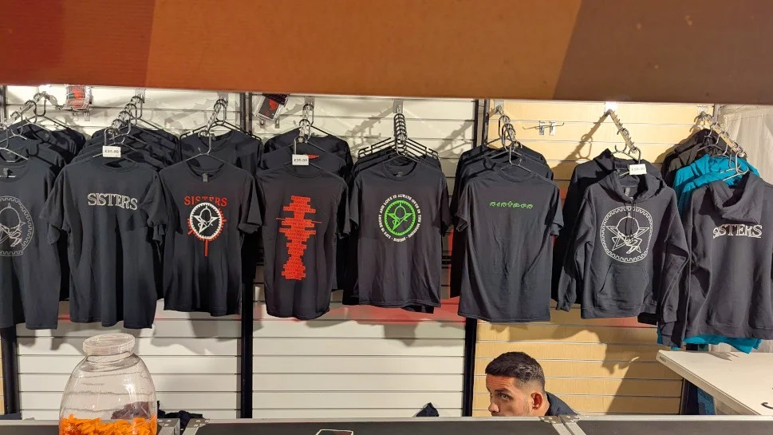

I took a half day off on flexi and was thinking of just popping down the the nearest pub until 7:30, when I was meeting Danny Gigantics. I looked out of my work window at the Pub below, and decided that it wasn't a good idea (it's the middle of the Edinburgh Festival) so there was no chance of me having a nice quiet time in the pub as it was rammed with tourists. Don't get me wrong, I love Edinburgh for it's diversity, tourists and general buzz, but sometimes, I'm just looking for a nice quiet corner to unwind and relax. So I headed homewards to relax and have lunch.

As it happens, my good friend Danny Gigantics was also going, so we arranged to meetup at platform 10 at Waverly Station. As with all the best laid plans, I just made it with minutes to spare...Pheww!

## The Venue

We where really lucky with the weather, but the [Kelvin Grove Bandstand](https://maps.app.goo.gl/iL3sE1dgmfvg17Jr6) was an awesome place to see the band, I'm hoping I get the opportunity to see other bands there.

## The Gig

You can read all about our thoughts on the Band on [Danny's Gigantic page](https://www.gig-antics.live/post/sisters-of-mercy-kelvingrove-bandstand-glasgow-15-08-25)

## Gig Photos

_Merch Store_

_Elizabeth Electra_

_Danny, Grant and Me_

<!--
In his own words Andrew Eldritch said near the end of the gig "We do not forgive and certainly haven't forgotten" but I'm glad I did after my last Sisters experience, for what was my best gig of the year so far (number 55 of 2025). 

My first, last and only Sisters gig barely made it past an hour when Slash V, me and a couple of others travelled to London in 2019 for a Roundhouse excursion. That may or may not have been down to a sub-par performance but might also have been down to the fact Slash & me finished off a full bottle of rum between us in the last hour of the train there earlier in the day! I also missed their Barrowlands gig a few years ago through illness, so it was third time lucky for me and a 10/10 gig it turned out to be.

Travelling through with me for this one Peni-Goth Bill (who was wearing a Cramps t-shirt that was older than his teenage son and mentioned it was his first trip to Glasgow in about seven years), and Gigeratti Grant, who met us in the leafy west end a few minutes walk from Kelvingrove Bandstand where it was also great to see some of the Glasgow West-End Gang goths and a few of the dedicated Sisters fans we know from gigging round the country who follow them almost everywhere. 

Pre-gig chat was unsurprisingly about what version of the Sisters were we going to see, as well as highlights from Rebellion punk festival the week before in Blackpool, the Deadinburgh goth event in Edinburgh last month and quirky folk festivals in Bedfordshire. There was also autobiography chat about Morrissey & Marr, Budgie from the Banshees and oddly Anne Marie Hursts impact on the collective group (some more than others but that's another story for another blog!).

We got in to catch most of the support act, Elisabeth Elektra, who I liked but felt the early timeslot with summer sunshine maybe took away a bit from the overall performance. A dark and atmospheric indoor setting would've been another thing entirely but I enjoyed their sound all the same. As Bill put it "Really good, just not my cup of tea, if I was going to pick a genre I would put her in the Pop/Goth stable. Saying that, it might be a slow burner, so I'm reserving the right to change my mind and gush enthusiastically when someone next asks me!"

Surprisingly for a Kelvingrove Bandstand Summer Sessions gig (the ones I go to at least) it was sunny, warm and dry, and as with the support, a bit of a different setting to see The Sisters come on stage in daylight but right from the first note their sound was tight and strong, energetic and attention grabbing and they had the crowds attention.

Their stage presence was great throughout and a good balance of Eldritchs prowling back and forward across the stage with Ben and Kai either joining in, or taking their own centre stage moment, getting the crowd going. I think their energy helps take some of the attention (and pressure) off Eldritch, who seemed happy to take a back seat behind the two of them at times. Based on this excellent performance I think this also keeps a high standard across the performance from everyone. No bad thing for the fans I'd say.

Their set was, as seems to always be, a shake up from previous shows and a mix of older recorded material and songs not (yet) released. I was told by a few folk there's maybe four albums worth of great music in there unreleased and on tonight's mix of songs, it would be great to hear how good it would be for even a fraction of that to make it's way onto vinyl. 

I enjoyed all of it though, some more familiar than others, so obviously the known quantities were highlights to hear them done live and so well (almost half of the 21 song set were unrecorded tracks). I especially liked the finale and encore of Temple Of Love, Neverland, Lucretia My Reflection and This Corrosion which were just immense.

To finally see them (for a full set!) I was pleased it was a good all round performance, not just Eldritch plus others (as I've heard some gigs through the years might've been) and I thoroughly enjoyed the whole show - as I said possibly my gig of the year so far. That's just my views though, so here's some comments from my gig buddies for the evening, Grant and Bill...

Gigeratti Grant "it was a very polished professional show, particularly from the new players. Eldritch is the weakest link now as he growled his way through the numbers. Personally I've always preferred Sisters mark one, so 'Marian' aside was slightly disappointed with the set list. However, the tracks from 'Floodland' sounded great too."

Peni-Goth Bill "I was pleasantly surprised with how well the band engaged with the crowd and played,  myself and most of the crowd seemed to enjoy it, it does help that the weather was great and there’s readily available bar. 

I really enjoyed their old stuff as it’s what I’ve been listening to since the 80’s and their new stuff does sound good, no doubt myself and everyone else in the crowd is wondering when the fourth LP is going to drop? 

The only thing that bothered me and probably just me, was Andrews difficulty hitting some of the higher notes, which having looked at the tour schedule for 2025, doesn’t really surprise me, don’t take that as a criticism though, because they still rocked!"

A summer sessions gig at Kelvingrove Bandstand is always a good start, add the legendary Sisters of Mercy into the mix with a solid performance (when they're on fire and don't crash & burn) with great company this is what gigging is all about - leaving you wanting More.
-->

## Reference

- Danny Gigantics - [Website](https://www.gig-antics.live/)
- Elisabeth Electra - [LinkTree](https://linktr.ee/elisaelektra)
- Elisabeth Elektra - [Facebook Page](https://www.facebook.com/elisabethelektramusic/)
- The Sisters of Mercy - [Wikipedia Page](https://en.wikipedia.org/wiki/The_Sisters_of_Mercy)
