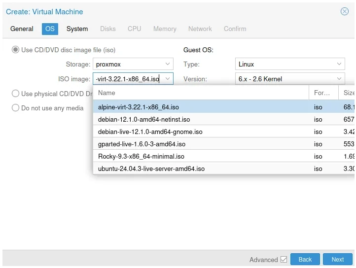
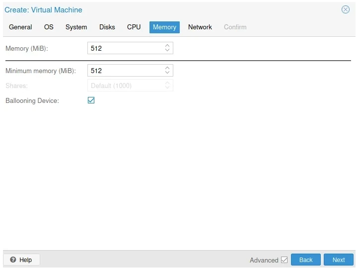
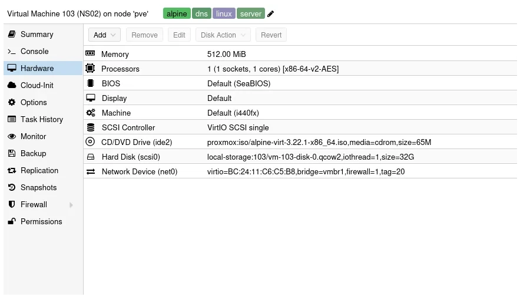

Having recently installed CoreDNS in a [docker container](https://thebloody.cloud/posts/Docker-CoreDNS/), I though that I would also try to install it on [Alpine Linux](https://www.alpinelinux.org/) in a Proxmox Virtual Machine, I might move it to proper hardware at some point, we will see. Saying that, it's working incredibly well with a really small footprint.

Below are the setting's I'm using for my container, do feel free to use them as a template. I'm using the **Virtual X86_64** version downloadable from [this page](https://alpinelinux.org/downloads/)

## Proxmox Settings

### General Settings

_General Settings_

### OS Settings

_OS Settings_

### Disk

_Disk_

### CPU

_CPU_

### Memory

_Memory_

### Network

This will probably be different for you, this docker container is resident on VLAN 20 on my network class C network 192.168.20.0/24

_Network_

### Hardware

A screenshot of my hardware, your hardware will be quite similar, but no doubt you'll change it to suite your own circumstances.

_Hardware_

## Initial Setup

Start the container and Login as root with no password then follow the following instuctions to install.

1. Type: setup-alpine
2. Select Keyboard layout: [none] gb
3. Select variant (or `abort`): gb
4. Enter System hostname (fully qualified form, e.g. `foo.example.org`) [localhost] ns1.local.lan
5. Available interfaces are: eth0
   Enter '?' for help on bridges, bonding and vlans.
6. Which on do you want to initialize? (or '?' or 'done') [eth0]
7. Ip address for eth0? (or 'dhcp', 'none' '?') [dhcp]
8. Do you want to do any manual network configuration? (y/n) (n)
9. Root password
10. Timezone GB
11. Which timezone are you in? (or '?' or 'none') [UTC] GB
12. Proxy none
13. PK Mirror
    Enter mirror number of URL: [1]
14. Setup a user? (enter a lower-case loginname, or 'no') billy
15. Full Name for user billy (billy) Billy Dickson
16. New Password
17. Retype Password
18. Enter ssh key or URL for billy (or `'none') [none]
19. Which ssh server? 'openssh', 'dropbear' or 'none') [openssh]
20. Which disk(s) would you like to use (or ? for help or none) [none] sda
21. How would you like to use it? ('sys', 'data', 'crypt', 'lvm' or '?' for help) sys
22. Warning: Erase the above disk(s) and continue (y/n) [n] y

## Configuring Alpine

### Update Alpine

Login as root, update the disto

```bash
apk update && apk upgrade
```

### Installing the nano text editor

```bash
apk add nano
```

### Adding an admin user

```bash
adduser <username> wheel
```

### Installing doas

**doas** is a simplified and lightweight utility that provides a way to execute commands as another user.

```bash
apk add doas
```

Configuration in the default config file /etc/doas.conf may be overridden by /etc/doas.d/*.conf if files exist.

To allow the members of the wheel group to use root privileges with doas command, a config file /etc/doas.d/20-wheel.conf can be created as follows:

```bash
nano /etc/doas.d/20-wheel.conf
```

```bash
permit persist  :wheel
```

### Installing the QEMU tools

Installing the QEMU tools to manage the Alpine Guest OS, if you're running it on a [Proxmox](https://www.proxmox.com) hypervisor.

Edit the repositories and enable community

```bash
doas nano /etc/apk/repositories
```

Install the qemu guest agen

```bash
doas apk add qemu-guest-agent
```

Make it presistant, enable it on reboot

```bash
doas rc-update add qemu-guest-agent
```

### Installing CoreDNS

```bash
doas apk add coredns
```

## References

- How to install [Alpine Linux on Proxmox](https://wiki.alpinelinux.org/wiki/Installing_Alpine_in_a_virtual_machine)
- How to prepare [Alpine Linux with Cloud init for Proxmox](https://5wire.co.uk/how-to-prepare-alpine-linux-image-with-cloud-init-ready-for-proxmox/)
- Self Hosting [CoreDNS on Alpine Linux](https://www.ipv6.rs/tutorial/Alpine_Linux_Latest/CoreDNS/)
- Installing [QEMU guest in Alpine](https://wiki.alpinelinux.org/wiki/Install_Alpine_in_QEMU#Create_the_Virtual_Machine)
- Krython.com - [Setting up Alpine Linux DNS Configuration](https://krython.com/post/setting-up-alpine-linux-dns-configuration)
- Krypton.com - [Installing and configuring an NTP server](https://krython.com/post/configuring-ntp-server)
- Techmint.com - [Installing and configuring an NTP server](https://www.tecmint.com/Install-chrony-in-centos-ubuntu-linux/)
- Setup CoreDNS on Alpine Linux - [philippeloncaux.com](https://philippeloctaux.com/blog/coredns-alpine/)
- Install and configure CoreDNS - [de-marco.net](https://di-marco.net/blog/it/2024-05-09-Intall_and_configure_coredns/)
