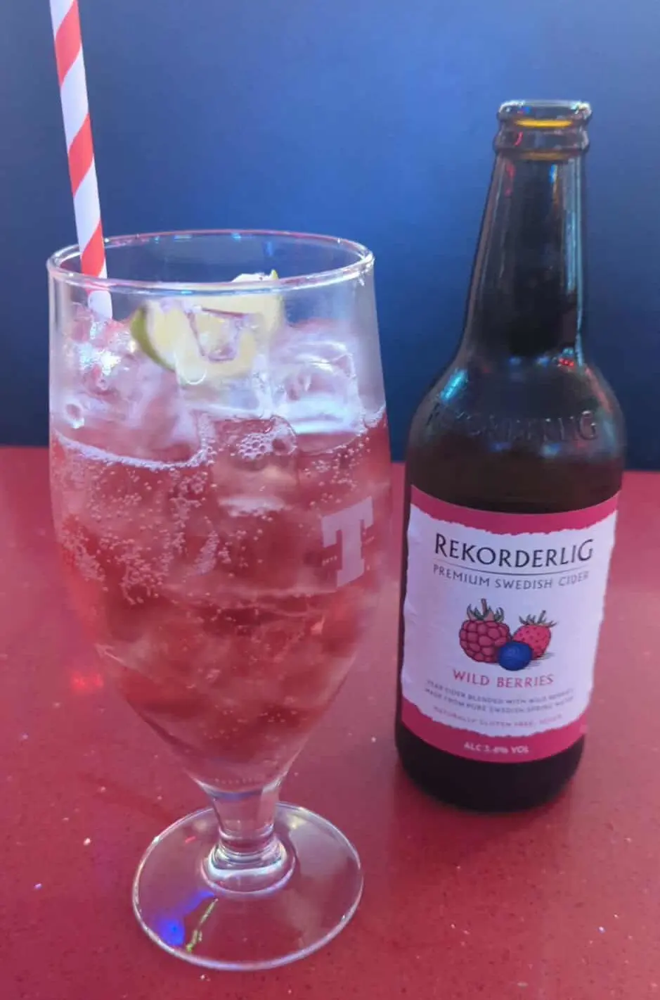
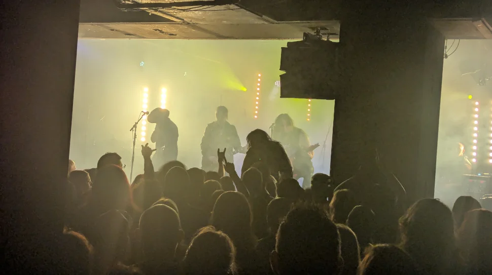

Finished my working day at my usual time of 4:30 then nipped into the toilet and surreptitiously changed my work shirt to my favourite alternative t-shitt of the day. Then headed down to grab some food at the city cafe, which looks to have changed into my regular pub (eatery) of choice when I’m gigging.

Below is a wee photo of my ladies drink (as Danny Gig-Antics would call it, or something along those lines 😉).

_Ladies Drink_

Dropped the guys a message to invite them down, if they're free.  I remember the day when you had to phone people to make plans (we now live in a world of convenience), which I’m ok with. The legend that is [Slash Vaseline](https://www.gig-antics.live/post/introducing-slash-vaseline), replied with the “I’m on the 62, I’ll be there at 17:45” or word to that effect 😃 So we had a few beers and a blether and headed down to the venue to meet up with [Danny (Gig-Antics)](https://www.gig-antics.live/).

### Thoughts on the bands

Having spend a wee bit of time listening to them on amazon music prior to the gig, my favourite was South of Salem followed closely by The 69 Eyes. After seeing both bands play, my opinion changed, and The 69 Eyes were my new favourite cheesy Goth/Rock band for all us “Children of the night” 😉, South of Salem weren’t too bad either if I’m honest.

## South of Salem

### Bio

A little snippet from their full interview in [emerging rock bands](https://emergingrockbands.co.uk/interview-south-of-salem/), do feel free to read the whole interview.

> Memorability is in the eye of the beholder, but the amount of laughs and cheeky humour in the interview leaves no doubt that there’s a genuine sense of fun around the South of Salem boys.  They seem to be having the time of their lives shooting for the moon, and perhaps their devil-may-care, try-anything-once attitude comes from their open affection for being a ‘DIY’ band, being as they are, reliant on their own labour.  It certainly seems as though they find it creatively freeing, permeating the two main things anyone will immediately notice.  Firstly, their music – the anthemic, singalong, heavy rock, reputed by the band to be influenced by ’80s arena and stadium rock, but at the same time twisted by their other major unique freedom -their on-stage aesthetic.  This is a fun and campy modern take on the likes of KISS and The Misfits of old – twisting an otherwise well-worn formula deep into the macabre, full of gothic face paint, histrionics and eerie horror-infused fun. Draper says that the origins of this were initially a commitment to a look that stemmed from his love of horror movies, but that it developed into something more detailed and by choice when the band caught on and got more involved. “It did start with me, because try to inject horror and gothic stuff into everything I do, so I definitely had an influence, but ultimately it happened organically – fortunately, we’re just very spooky people!” he remarks, smiling.

### Photos

_South of Salem_

_South of Salem_

## The 69 Eyes

### The 69 Eyes Bio

> When the sun goes down and the moon comes up Finnish goth glam goo goo mucks THE 69 EYES proudly wear their sunglasses, leather jackets and black eyeliner to become one with the night. Founded in the hazy, murky, twilit bars of Helsinki more than 30 years ago, the band circling around Scandinavian goth rock epitome Jyrki 69 has done exemplary service to all things dark, releasing twelve revered albums, touring the world over, even going platinum in their home country, all the while maintaining a strong tie to the graveyard shift of rock’n’roll.
>
>
> With an eclectic penchant for morbidity, glamour, sex and the supernatural, these nocturnal animals embody both the foggy essence of Scandinavian goth rock and the lusty decadence of Sunset Strip glam, haunting everyone from goth rock ghoul to metal dude, from glam rock cat to rockabilly fiend. It’s classy, it’s sexy, it’s raunchy, it’s dramatic: Their fateful, ominous thirteenth album “Death of Darkness” celebrates this unholy union with a new set of lovesongs to the darkness in all of us, proudly howling at the moon and sinking their fangs deep within our necks. Come, sweet death, and have a drink with me. The night is young and life is short.

### The 69 Eyes Photos

_The 69 Eyes_

_The 69 Eyes_

_The 69 Eyes_

_The 69 Eyes_

_The 69 Eyes_

## References

- South of Salem - Emerging Rock Bands [website](https://emergingrockbands.co.uk/interview-south-of-salem/)
- The 69 Eyes [Website](https://69eyes.com/)
