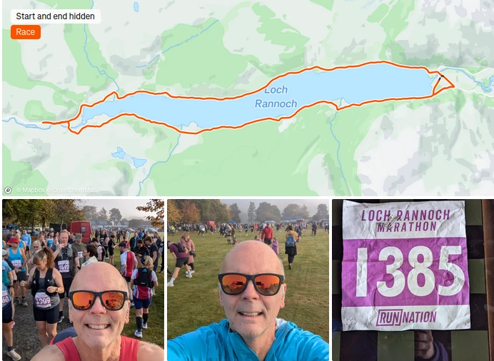
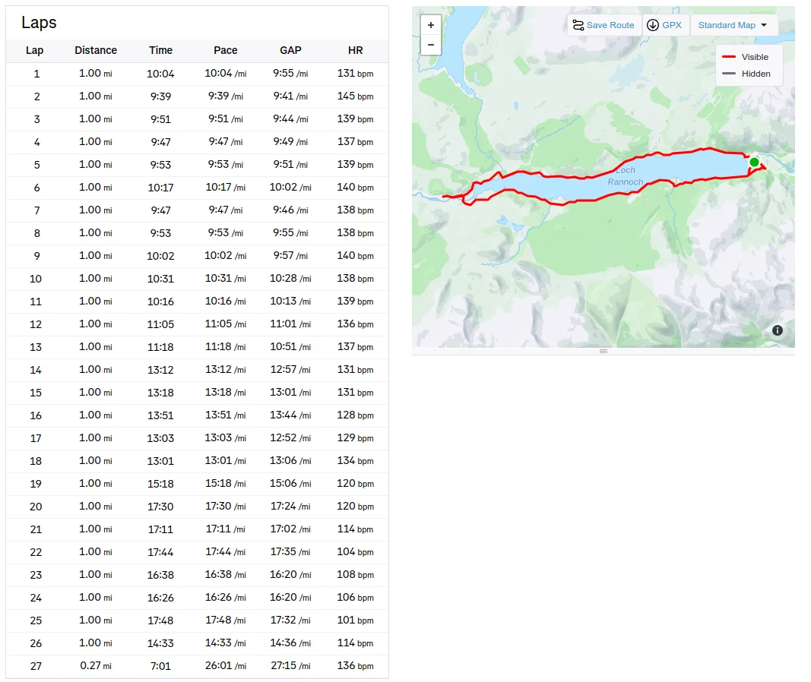
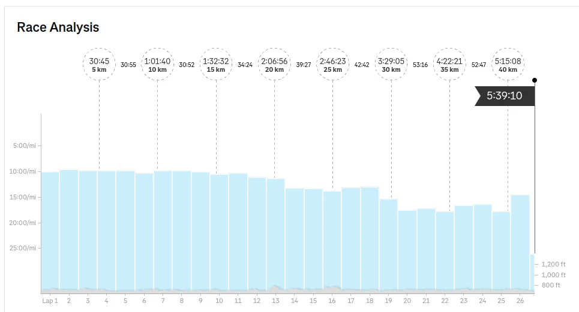

If I'm honest with myself, this Marathon was probably my worst, I wasn't feeling good out of the gate. Definitely feeling lethargic and a bit under the weather, having to cut some of my fast runs out and dropping the longer run mileages 3 weeks prior to the race  because of a grumbly right knee. And I did have to walk the last 5 miles (knee and calf issues).

On a positive note, I managed to dig in and get it done and I did enjoy it (Type 2 fun).

## Photos

_Slefie_

_Running Stats_

_Running Stats_

## Thoughts

Loved it, the weather was brilliant and the runners were all ace, the scenery was superb and as I was walking the last 5 miles, I got the change to appreciated it and chat to other injured runners, so every cloud has a silver lining. Would I run it again? absolutely!

## Lessons Learnt

1. As you get older, and you loose muscle mass, I need look into gym work to support my running
2. More short fast stuff during the week (Cut down the mileage, but increase the speed)
3. Cut the long run at the weekend to maybe 13 miles max
4. Look into supplements to support my joints

## References

- Run Nation - [Rannoch Marathon 2025 Race Results](https://runnation.co.uk/results/rannochmarathon2025)
- Facebook Photo of the Event - [Christopher Burns - Image Ecosse](https://www.facebook.com/media/set?vanity=100037924607380&set=a.1650208616253276)
- Loch Rannoch Marathon [Elevation Graph](https://www.plotaroute.com/routeprofile/1295452)
- Penicuik Harriers Blog - [Loch Rannoch Marathon](https://penicuikharriers.org.uk/2016/10/17/loch-rannoch-marathon-16102016/)
