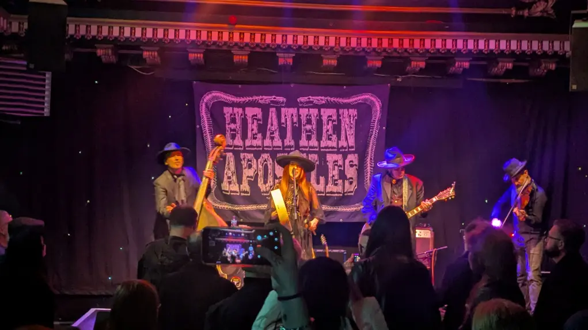
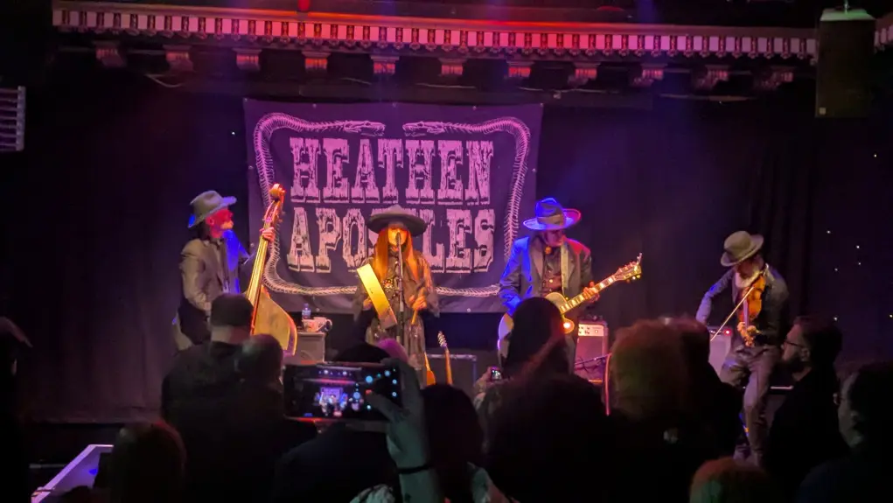
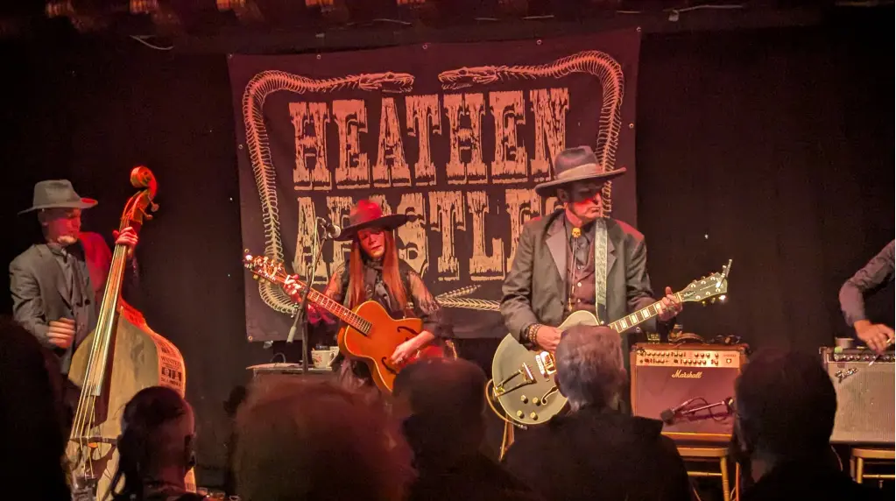
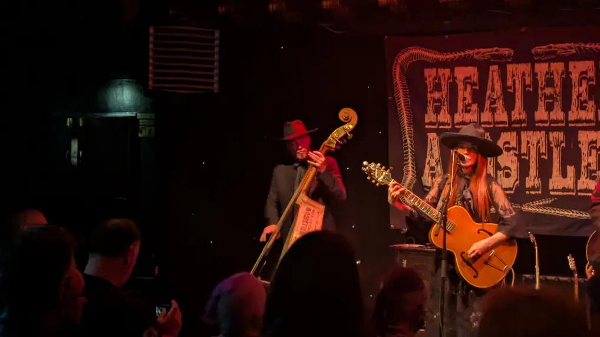
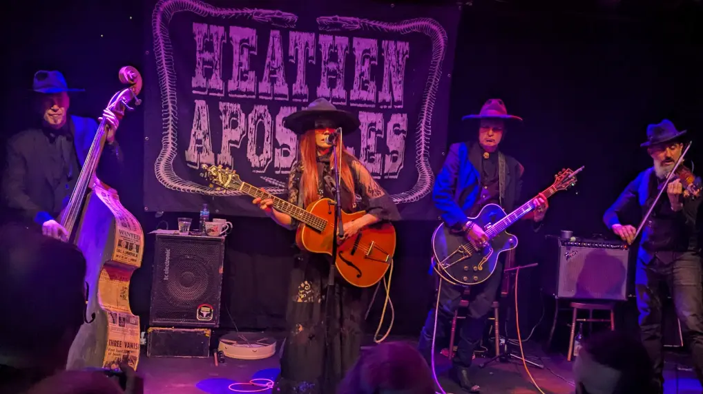
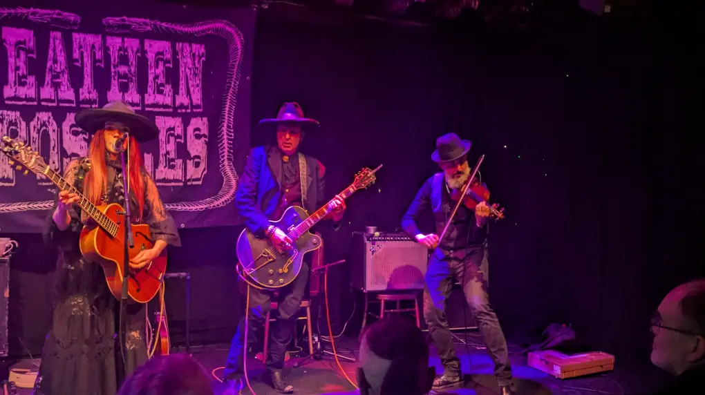
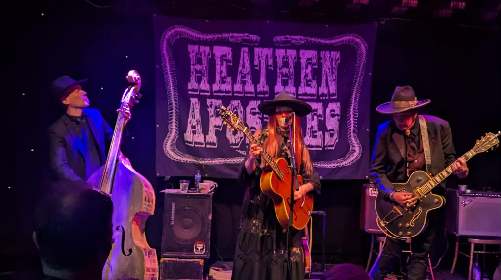
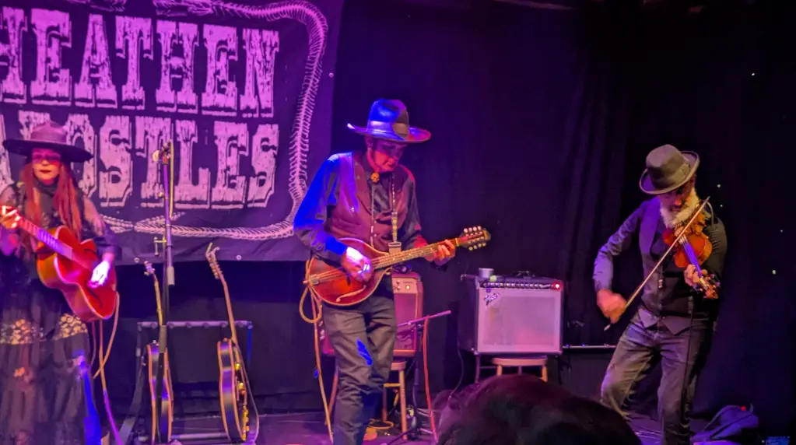

Finished work, got changed and popped down to the [Guildford Arms](https://guildfordarms.com/) as it's the closest to the Venue ([The Voodoo Rooms](https://www.thevoodoorooms.com/)) ordered some food and settled in upstairs for a while, young master [Slash Vaseline](https://www.gig-antics.live/post/introducing-slash-vaseline) was heading toward the Guildford, so I ordered a wee libation and did a bit of people watching, my favourite sport when I'm just chilling and waiting for folks.

Originally, I bought the ticket on the advice of [Danny Gig-Antics](https://gig-antics.live) who has seen them on a number of occasions and thought I would like them, he did say they were a bit [Marmite](https://anamericansguidetobritishlife.substack.com/p/marmite-you-either-love-it-or-hate). But as it happens, he was spot on the money as usual and I did enjoy them. After a bit of reflection, if I was going to put them in a category and try to describe them, then the Facebook description below is spot on. I did chuckle when the singer described the double bass player and the violin player as "American, when they want to be".

## Facebook Page

> Forming the Heathen Apostles in 2013, Mather Louth (Radio Noir) and rock n roll veteran Chopper Franklin (The Cramps, Mau Maus, Nick Curran & the Lowlifes) quickly uncovered a mutual appreciation for murder balladry, Americana, and memento mori.
>
>The band's sonic landscape was further tilled with the addition of Thomas Lorioux (Kings of Nuthin', Legendary Shack Shakers) on bass and Luis Mascaro on violin.
>
>Their 7 critically acclaimed albums, along with their many EPs and singles (their release The Fall was named Best E P of 2018 by Folk n Rock magazine), capture the essence of the Heathen Apostles modus operandi: Southern Gothic Americana imagery surrounded by haunting, minor-chord melodies, musical influences including Gothic Roots music, Bluegrass, Blues, and Gypsy Jazz, all deftly bound together by the band's dark and sometimes brooding sense of a bygone age.
>
>“As if plucked from a surreal spaghetti western, Mather Louth and Chopper Franklin made quite the spectacle, striding down London's Pentonville Road in full regalia... The Heathen Apostles had etched themselves into our dark hearts, ensuring their spectral melodies and mystical storytelling would stay with us long after the last note had faded into the night." Ist 3 Magazine

## Gig Photos

_Heathen Apostles_

_Heathen_Apostles_

_Heathen Apostles_

_Heathen Apostles_

_Heathen Apostles_

_Heathen Apostles_

_Heathen Apostles_

_Heathen Apostles_

## Wikipedia Entry

> The Heathen Apostles are a [gothic Americana](https://en.wikipedia.org/wiki/Gothic_country) band formed in 2013 by Chopper Franklin and Mather Louth, who perform a mix of [western music](https://en.wikipedia.org/wiki/Western_music_(North_America)), with [post-punk](https://en.wikipedia.org/wiki/Post-punk) and [gothic rock](https://en.wikipedia.org/wiki/Gothic_rock) elements. [[1]](https://folknrock.com/reviews/album-review-heathen-apostles-dust-to-dust) Two of their albums have been included in "best of the year" lists by Folk N Rock magazine. [[2]](https://folknrock.com/news/the-best-albums-of-2019) [[3]](https://folknrock.com/rock/the-best-albums-of-2018)

## References

- Heathen Apostles - [Website](https://heathenapostles.com/)
- Heathen Apostles - [Wikipedia Page](https://en.wikipedia.org/wiki/Heathen_Apostles)
- The Guildford Arms - [Website](https://guildfordarms.com/)
