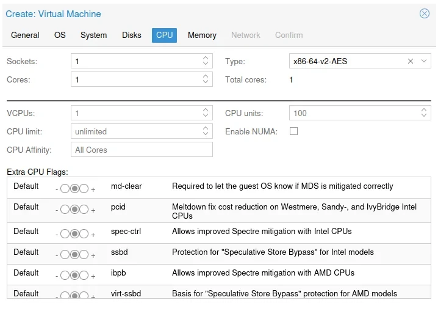
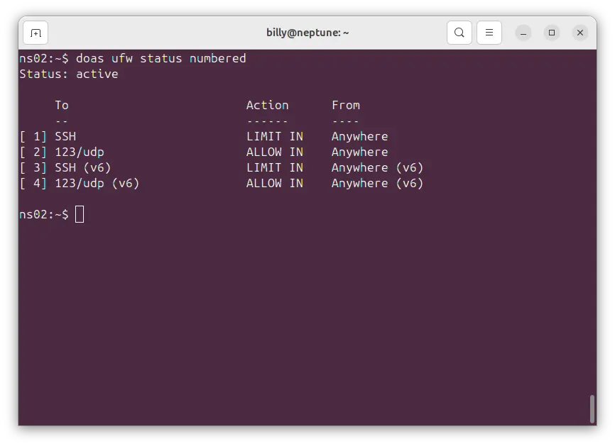
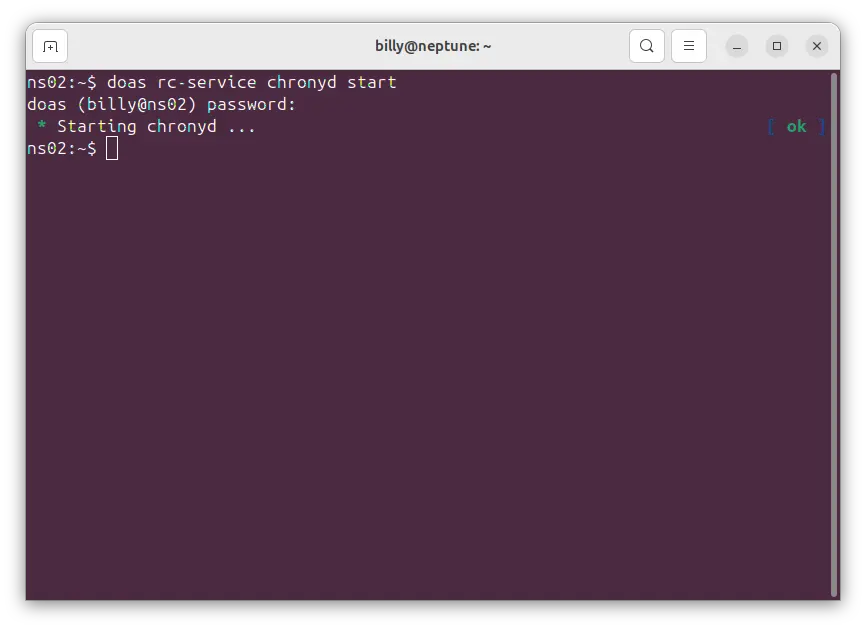
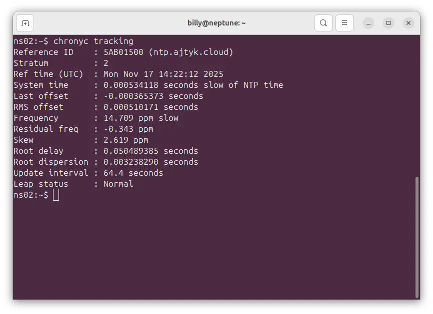
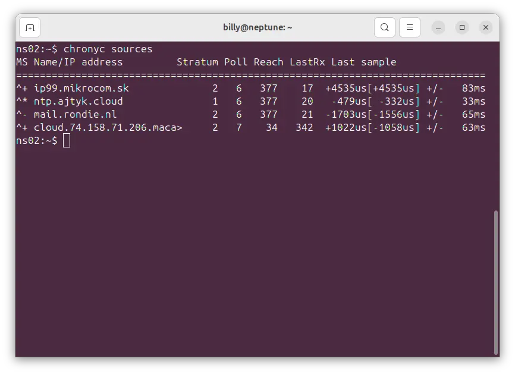
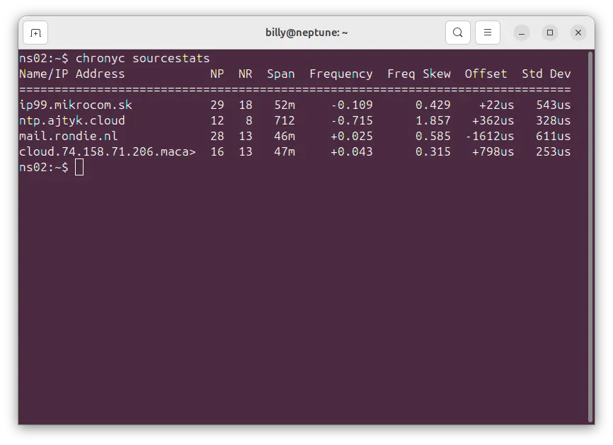
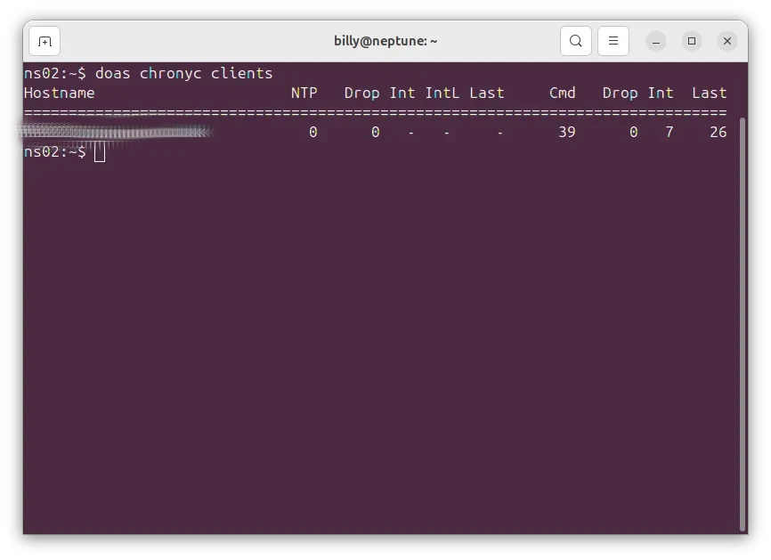

## Proxmox Settings

### General Settings

_General Settings_

### OS Settings

_OS Settings_

### Disk

_Disk_

### CPU

_CPU_

### Memory

_Memory_

### Network

This will probably be different for you, this docker container is resident on VLAN 20 on my class C private network 192.168.20.0/24

_Network_

### Hardware

A screenshot of my hardware, your hardware will be quite similar, but no doubt you'll change it to suite your own circumstances.

_Hardware_

## Initial Setup

From Proxmox, select console then login as root with no password and follow the following instuctions to setup.

1. Type: setup-alpine
2. Select Keyboard layout: [none] gb
3. Select variant (or `abort`): gb
4. Enter System hostname (fully qualified form, e.g. `foo.example.org`) [localhost] ns1.local.lan
5. Available interfaces are: eth0
   Enter '?' for help on bridges, bonding and vlans.
6. Which on do you want to initialize? (or '?' or 'done') [eth0]
7. Ip address for eth0? (or 'dhcp', 'none' '?') [dhcp]
8. Do you want to do any manual network configuration? (y/n) (n)
9. Root password
10. Timezone GB
11. Which timezone are you in? (or '?' or 'none') [UTC] GB
12. Proxy none
13. PK Mirror
    Enter mirror number of URL: [1]
14. Setup a user? (enter a lower-case loginname, or 'no') billy
15. Full Name for user billy (billy) Billy Dickson
16. New Password
17. Retype Password
18. Enter ssh key or URL for billy (or `'none') [none]
19. Which ssh server? 'openssh', 'dropbear' or 'none') [openssh]
20. Which disk(s) would you like to use (or ? for help or none) [none] sda
21. How would you like to use it? ('sys', 'data', 'crypt', 'lvm' or '?' for help) sys
22. Warning: Erase the above disk(s) and continue (y/n) [n] y

## Configuring Alpine

### Update Alpine

Login as root, update the disto

```bash
apk update && apk upgrade
```

### Installing nano

```bash
apk add nano
```

### Install fastfetch (optional)

```bash
apk add fastfetch
```


### Adding an admin user

```bash
adduser <username> wheel
```

### Installing doas

**doas** is a simplified and lightweight utility that provides a way to execute commands as another user.

```bash
apk add doas
```

Configuration in the default config file /etc/doas.conf may be overridden by /etc/doas.d/*.conf if files exist.

To allow the members of the wheel group to use root privileges with doas command, a config file /etc/doas.d/20-wheel.conf can be created as follows:

```bash
nano /etc/doas.d/20-wheel.conf
```

Add the following:

```bash
permit persist  :wheel
```

### Installing the QEMU tools

Installing the QEMU tools to manage the Alpine Guest OS, if you're running it on a [Proxmox](https://www.proxmox.com) hypervisor.

Edit the repositor and enable community

```bash
doas nano /etc/apk/repositories
```

Install the qemu guest agent

```bash
doas apk add qemu-guest-agent
```

Make it presistant, enable it on reboot

```bash
doas rc-update add qemu-guest-agent
```

## Securing Alpine Linux

### Enabling automatic updates

Based on an excellent article by [Isaac Bythewood](https://blog.bythewood.me/posts/minimal-automated-updates-for-alpine-linux/) we're going to create a bash script that will be run by a cron job every night at 2:00 in the morning, that checks for updates and applies them.

Change directory to **/etc/periodic/daily/**

```bash
cd /etc/periodic/daily
```

Create a file called apk-autoupgrade

```bash
doas nano apk-autoupgrade
```

Add the following

```bash
apk upgrade --update | sed "s/^/[`date`] /" >> /var/log/apk-autoupgrade.log"
```

Tighten up the permissions to allow the script to run

```bash
doas chmod 700 /etc/periodic/daily/apk-autoupgrade
```

### Installing and setting up UFW Firewall

UFW stands for Uncomplicated Firewall, and is a program for managing a netfilter firewall. It provides a command line interface and aims to be uncomplicated and easy to use. I'm using the instructions provided by the [alpinelinux wiki](https://wiki.alpinelinux.org/wiki/Uncomplicated_Firewall) to install and configure to my needs.

Check to make sure that the community repository is uncommented.

```bash
doas nano /etc/apk/repositories
```

```bash
#/media/cdrom/apks
http://dl-cdn.alpinelinux.org/alpine/v3.22/main
http://dl-cdn.alpinelinux.org/alpine/v3.22/community
```

If it's the same as above, all is well, you can now install the package.

```bash
doas apk add ip6tables iptables ufw
```

Reboot the VM, then continue with the rest of the instructions.

```bash
doas reboot
```

Some basic setup before enabling the firewall, you don't want to lock yourself out.

```bash
doas ufw default deny incoming
doas ufw default allow outgoing
```

Open SSH port and protect against brute-force login attacks

```bash
doas ufw limit SSH
```

Allow inbound NTP

```bash
doas ufw allow in ntp
```

Enable the firewall

```bash
doas ufw enable
```

Enable the UFW startup init script

```bash
doas rc-update add ufw
```

A list firewall rules.



## Installing chrony (NTP Server)

### Installation

Installing chrony and time tools

```bash
doas apk add chrony tzdata
```

### Setup Chrony

Backup the original configuration file.

```bash
doas cp /etc/chrony/chrony.conf /etc/chrony/chrony.conf.backup
```

Edit the chrony config file

```bash
doas nano /etc/chrony/chrony.conf
```

Replace with the following.

```bash
# Use public NTP servers
server 0.pool.ntp.org iburst
server 1.pool.ntp.org iburst
server 2.pool.ntp.org iburst
server 3.pool.ntp.org iburst

# Allow clients from local network
# Feel free to tighten up the following allowed networks
allow 127.0.0.0/8
allow 192.168.0.0/16
allow 172.16.0.0/20
allow 10.0.0.0/8

# Serve time even if not synchronized
local stratum 10

# Enable NTP server functionality
port 123

# Drift file to remember clock speed
driftfile /var/lib/chrony/drift

# Log directory
logdir /var/log/chrony

# Make steps larger than 1 second
makestep 1.0 3

# Enable kernel synchronization
rtcsync
````

Code explanation:

- server: External time sources to sync with
- allow: Networks that can get time from this server
- local stratum 10: Act as time source even when offline
- port 123: Standard NTP port
- makestep: Allow big time corrections

Enable and start Chrony

Add chrony to the startup service

```bash
doas rc-update add chronyd default
```

Start the chrony service now

```bash
doas rc-service chronyd start
```



### Testing Chrony

Bare in mind, your output will be slighty different to mine.

Checking chronyd status

```bash
chronyc tracking
```



List time sources

```bash
chronyc sources
```



Show detailed source information

```bash
chronyc sourcestats
```



chronyc clients

```bash
doas chronyc clients
```



## References

- Crony - [Introduction](https://chrony-project.org/index.html)
- Krypton.com - [Installing and configuring an NTP server](https://krython.com/post/configuring-ntp-server)
- Techmint.com - [Installing and configuring an NTP server](https://www.tecmint.com/Install-chrony-in-centos-ubuntu-linux/)
- How to change [time date settings on Ubuntu](https://phoenixnap.com/kb/how-to-set-or-change-timezone-date-time-ubuntu)
