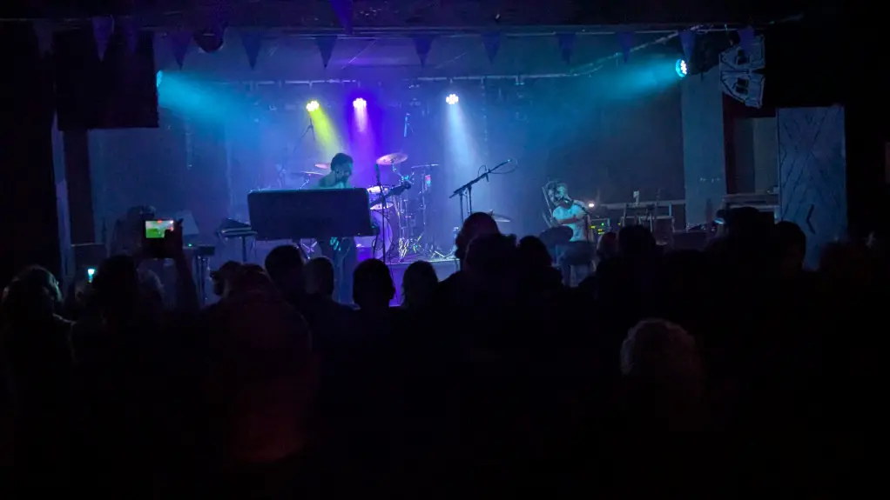
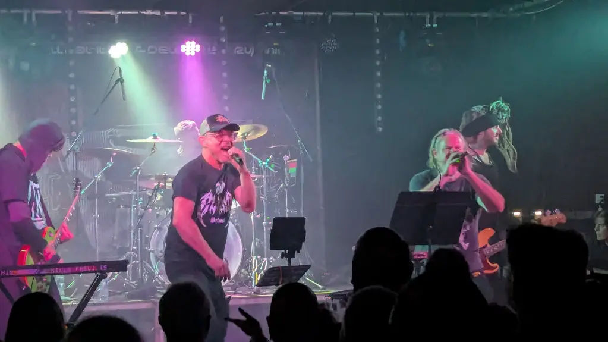
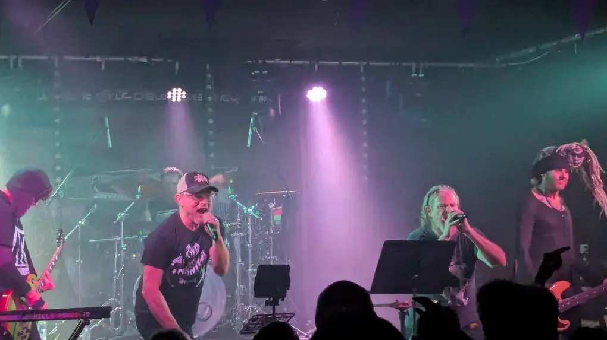
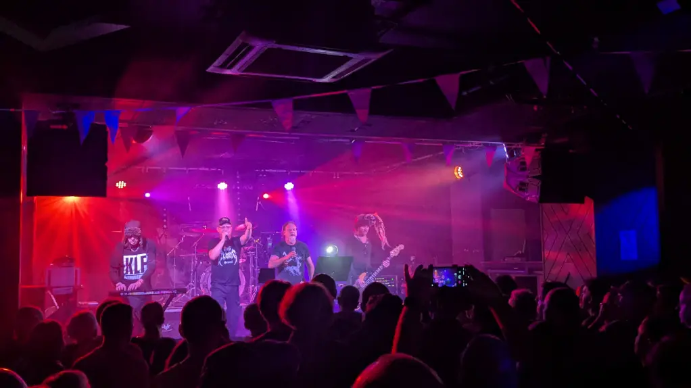

Being a Saturday and having done everything on my families tick list, I had arranged to jump on the same bus to Edinburgh as my compadre [Mr Slash Vaseline](https://www.gig-antics.live/post/introducing-slash-vaseline). We had already prearranged a pre-gig drink with [Danny Gig-Antics](https://www.gig-antics.live) at the [Guilded Saloon](https://maps.app.goo.gl/ru3xsXKUpMierPXc7).

I wasn't impressed with the food options, so we headed along the road to the [Paradise Palms](https://maps.app.goo.gl/sJvRwUuFjxGRbE8Y6), FYI their chicken nuggets are fab 🐔 👍. After I was pleasently full, we headed along to La Belle Angele and managed to see the last 2 songs from the GANS and I've got to say, myself [Danny Gig-Antics](https://www.gig-antics.live) and [Slash Vaseline](https://www.gig-antics.live/post/introducing-slash-vaseline) thought they were belters! I'm really going to have to see a whole set next time they are in Edinburgh.

## The Gig

The Venue - [La Belle Angele](https://la-belleangele.com/)

### GANS

A wee snippet in [louderthanwar](https://louderthanwar.com/listen-gans/) by John Robb with the video clip he mentioned, go read it, its well worth it, and I've got to say, the video's a banger!

> We are loving this track from GANS. It’s a genius shouty stomp of a single like a meeting between Insane in the Membrane and the
Sleaford Mods but with guitars. A big bouncing beast of a tune that has a hook line in its kitchen sink drama...
> GANS release a new single I Think I Like You through Strap Originals on Wednesday March 5th. I Think I Like You was produced and
mixed by Ross Orton (Arctic Monkeys, Amyl & The Sniffers, Yard Act, M.I.A, Working Men’s Club, The Fall) in Sheffield in December 2024.



_GANS_

_GANS_

_GANS_

### Pop Will Eat Itself

A little snippet from their Wikipedia page, do feel free to read it in its [entirety](https://en.wikipedia.org/wiki/Pop_Will_Eat_Itself).

> Pop Will Eat Itself are an English [alternative](https://en.wikipedia.org/wiki/Alternative_rock) rock band formed in 1986 in [Stourbridge](https://en.wikipedia.org/wiki/Stourbridge) in the [West Midlands](https://en.wikipedia.org/wiki/West_Midlands_(region)) of England with members from [Birmingham](https://en.wikipedia.org/wiki/Birmingham), [Coventry](https://en.wikipedia.org/wiki/Coventry) and the [Black Country](https://en.wikipedia.org/wiki/Black_Country). Initially known as a [grebo](https://en.wikipedia.org/wiki/Grebo_(music)) act, they changed style to incorporate [sample-driven](https://en.wikipedia.org/wiki/Sampling_(music)) [indie](https://en.wikipedia.org/wiki/Indie_rock) and [industrial rock](https://en.wikipedia.org/wiki/Industrial_rock). Graham Crabb describes their sound as "electronic, punk, alternative hip-hop, hybrid music for fucking, fighting & smoking cigars". Their highest-charting single was the 1993 top-ten hit "Get the Girl! Kill the Baddies!".[3] After initially disbanding in 1996, and having a brief reformation in 2005, they issued their first release in more than five years in 2010.

Set list from [setlist.fm](https://www.setlist.fm/setlist/pop-will-eat-itself/2025/la-belle-angele-edinburgh-scotland-b41e93e.html), so take it with a pinch of salt.

1. The Slammer
2. Wise Up! Sucker
3. Incarcerate The Rich
4. Get the Girl! Kill the Baddies!
5. Bruiser
6. Everything's Cool
7. Disco Misfits
8. PWEI-zation
9. Dance of the Mad Bastards
10. Never Mind the Botox
11. Def Con One
12. Play A Fast 'Un
13. Bulletproof!
14. Their Law (The Prodigy cover)
15. Built For Fun
16. Ich bin ein Ausländer

_Pop Will Eat Itself_

_Pop Will Eat Itself_

_Pop Will Eat Itself_

_Pop Will Eat Itself_

## References

- Pop Will Eat Itself - [Website](https://popwilleatitself.co.uk/)
- Pop will Eat Itself - [LinkTree](https://linktr.ee/popwilleatitselfofficial)
- Pop Will Eat Itself - [Book](https://pweibook.com/about-us)
- GANS - [louderthanwar.com](https://louderthanwar.com/listen-gans/)
