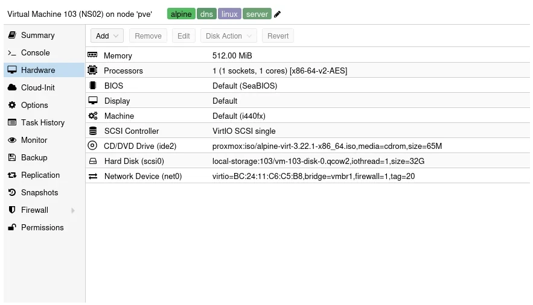
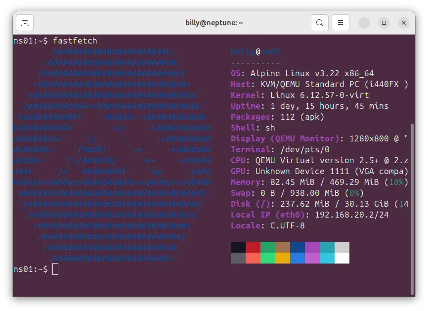

Having used Alpine Linux in a couple of homelab projects recently, I thought that I would try running docker on a [Alpine Linux](https://www.alpinelinux.org/) virtual machine inside Proxmox.

The virtual image I'm using works great in my homelab, but if I was going to be using it outside or in a externally hosted scenario, I would definately install and configure auditing.


Below are the setting's I'm using for my container, do feel free to use them as a template. I'm using the **Virtual X86_64** version downloadable from [this page](https://alpinelinux.org/downloads/)

## Proxmox Settings

### General Settings

_General Settings_

### OS Settings

_OS Settings_

### Disk

_Disk_

### CPU

_CPU_

### Memory

_Memory_

### Network

This will probably be different for you, this docker container is resident on VLAN 20 on my class C private network 192.168.20.0/24

_Network_

### Hardware

A screenshot of my hardware, your hardware will be quite similar, but no doubt you'll change it to suite your own circumstances.

_Hardware_

## Initial Setup

From Proxmox, select console then login as root with no password and follow the following instuctions to setup.

1. Type: setup-alpine
2. Select Keyboard layout: [none] gb
3. Select variant (or `abort`): gb
4. Enter System hostname (fully qualified form, e.g. `foo.example.org`) [localhost] ns1.local.lan
5. Available interfaces are: eth0
   Enter '?' for help on bridges, bonding and vlans.
6. Which on do you want to initialize? (or '?' or 'done') [eth0]
7. Ip address for eth0? (or 'dhcp', 'none' '?') [dhcp]
8. Do you want to do any manual network configuration? (y/n) (n)
9. Root password
10. Timezone GB
11. Which timezone are you in? (or '?' or 'none') [UTC] GB
12. Proxy none
13. PK Mirror
    Enter mirror number of URL: [1]
14. Setup a user? (enter a lower-case loginname, or 'no') billy
15. Full Name for user billy (billy) Billy Dickson
16. New Password
17. Retype Password
18. Enter ssh key or URL for billy (or `'none') [none]
19. Which ssh server? 'openssh', 'dropbear' or 'none') [openssh]
20. Which disk(s) would you like to use (or ? for help or none) [none] sda
21. How would you like to use it? ('sys', 'data', 'crypt', 'lvm' or '?' for help) sys
22. Warning: Erase the above disk(s) and continue (y/n) [n] y

## Configuring Alpine

### Update Alpine

Login as root, update the disto

```bash
apk update && apk upgrade
```

### Installing nano

```bash
apk add nano
```

### Install fastfetch (optional)

```bash
apk add fastfetch
```



### Adding an admin user

```bash
adduser <username> wheel
```

### Installing doas

**doas** is a simplified and lightweight utility that provides a way to execute commands as another user.

```bash
apk add doas
```

Configuration in the default config file /etc/doas.conf may be overridden by /etc/doas.d/*.conf if files exist.

To allow the members of the wheel group to use root privileges with doas command, a config file /etc/doas.d/20-wheel.conf can be created as follows:

```bash
nano /etc/doas.d/20-wheel.conf
```

Add the following:

```bash
permit persist  :wheel
```

### Installing the QEMU tools

Installing the QEMU tools to manage the Alpine Guest OS, if you're running it on a [Proxmox](https://www.proxmox.com) hypervisor.

Edit the repositor and enable community

```bash
doas nano /etc/apk/repositories
```

Install the qemu guest agent

```bash
doas apk add qemu-guest-agent
```

Make it presistant, enable it on reboot

```bash
doas rc-update add qemu-guest-agent
```

## Installing Docker

### Install the docker package and tools

```bash
doas apk add docker docker-compose
```

### Start the docker daemon at boot

```bash
doas rc-update add docker default
doas service docker start
```

Connecting to the Docker daemon through its socket requires you to add yourself to the docker group.

```bash
doas addgroup ${USER} docker
```

### Testing the docker install

```bash
docker run hello-world
```

Expected results

_Hello World_

## References

- Ten Cent Cloud - Install [Docker on Alpine Linux](https://www.tencentcloud.com/techpedia/100542)
- Alpine Wiki - [Installing Docker](https://wiki.alpinelinux.org/wiki/Docker)
- The Linux Code - [Install Docker on Alpine Linux](https://wiki.alpinelinux.org/wiki/Docker)
- Great starting point [installing and setting up Alpine linux](https://cleberg.net/blog/alpine-linux.html)
