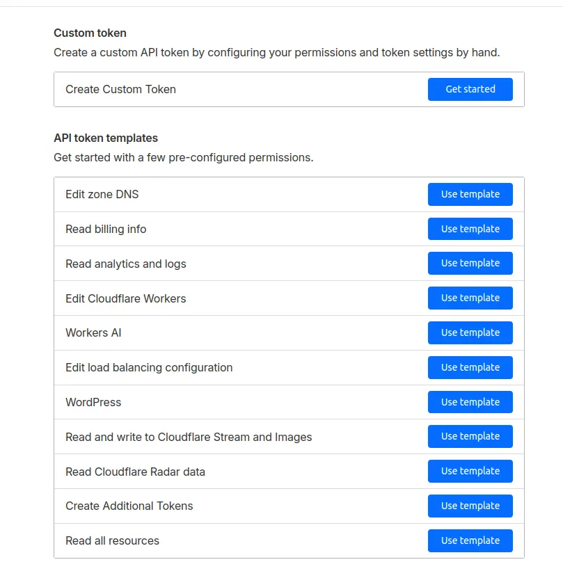
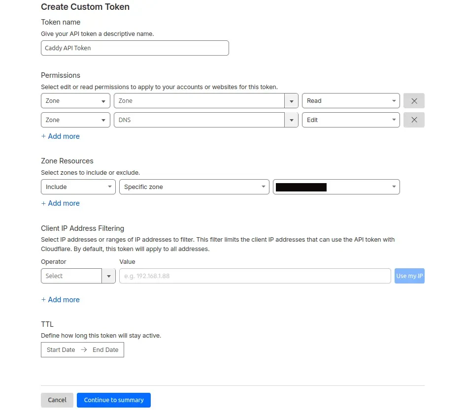
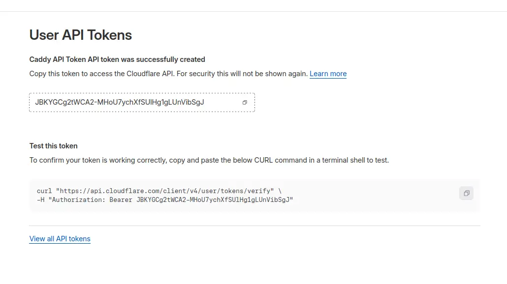

## Requirements

1. A working docker host, either virtual (Proxmox in my [case](https://thebloody.cloud/posts/Installing-Docker-on-Alpine-Linux/)) or bare metal.
2. A domain registered with Cloudflare.
3. The ability to add internal DNS records for your registered domain, [internal DNS](https://thebloody.cloud/posts/Installing-CoreDNS-on-Alpine/) server.
4. A working knowledge of Docker, Linux and Networking.

### Create a directory structure for your docker files

```bash
mkdir docker
cd docker
mkdir caddy
cd caddy
```

### Getting a Cloudflare API token for your Domain

1. Go to [https://dash.cloudflare.com/profile/api-tokens](https://dash.cloudflare.com/profile/api-tokens)
2. Click "Create Custom Token"


3. Set permissions

    Zone:Zone:Read

    Zone:DNS:Edit

4. Set Zone Resources to include your domain (s)





Take a note of the Cloudflare API Token and plug it into the .env file below, the cloudflare email address is the address that you would use to log into your Cloudflare account.

### Create an .env file container your Cloudflare details

```bash
# Cloudflare credentials for DNS challenge
# Replace with your actual Cloudflare email and API token

CLOUDFLARE_EMAIL=<billy@example.com>
CLOUDFLARE_API_TOKEN=<Your Cloudflare API Token>
# To get your Cloudflare API token:
# 1. Go to https://dash.cloudflare.com/profile/api-tokens
# 2. Click "Create Token"
# 3. Use "Custom token" template
# 4. Set permissions:
#    - Zone:Zone:Read
#    - Zone:DNS:Edit
# 5. Set Zone Resources to include your domain(s)
# 6. Copy the generated token and paste it above

```

### File Structure

```bash
 docker
    └── caddy
        ├── .env
        ├── Caddyfile
        └── docker-compose.yml
```

### Docker Compose file

```bash
nano docker-compose.yml
```

Below is thmy docker-compose.yml file, do feel free to change it to suite your needs. The network stanza is specific to my needs, so I've commented them out.

```yaml
services:
  caddy:
    image: caddybuilds/caddy-cloudflare:latest
    container_name: caddy
#    networks:
#       - blackhole
    restart: unless-stopped
    cap_add:
      - NET_ADMIN
    ports:
      - "80:80"
      - "443:443"
      - "443:443/udp"
    volumes:
      - $PWD/Caddyfile:/etc/caddy/Caddyfile
      - caddy-data:/data
      - caddy-config:/config
    environment:
      - CLOUDFLARE_EMAIL=${CLOUDFLARE_EMAIL}
      - CLOUDFLARE_API_TOKEN=${CLOUDFLARE_API_TOKEN}
    env_file:
      - .env

volumes:
  caddy-data:
     name: caddy-data
  caddy-config:
     name: caddy-config

# networks:
#   blackhole:
#   name: blackhole
#   external: true
```

### Create a Caddyfile

Below is my Caddyfile, I've chosen to restrict access to my home network, see the (internal_only) stanza, feel free to comment this out if you intend make it internet facing. If your going to use it in a homelab environmnt, then I would suggest placing the VM in a [DMZ zone](https://en.wikipedia.org/wiki/DMZ_(computing)).

[What is a non Routable Private address space](https://en.wikipedia.org/wiki/Private_network)

```bash
nano /etc/caddy/Caddyfile
```

```yaml
{
    # Global Options
    # ACME DNS configuration using Cloudflare
    # acme_dns cloudflare {env.CLOUDFLARE_API_TOKEN}

    email {env.CLOUDFLARE_EMAIL}
}

# Snippet for internal-only access
(internal_only) {
    @not_internal not remote_ip 192.168.0.0/16 10.0.0.0/8 172.16.0.0/12
    respond @not_internal "Access Denies" 403
}

# Snippet for common settings
(common) {
    encode zstd gzip
    header {
        # Security headers
        Strict-Transport-Security "max-age=31536000; includeSubDomains; preload"
        X-Content-Type-Options nosniff
        X-Frame-Options DENY
        Referrer-Policy no-referrer-when-downgrade
    }
}

# Site block for root and all subdomains
example.com, *.example.com {
    import common

    # Required for Wildcard certs via Cloudflare DNS
    tls {
        dns cloudflare {env.CLOUDFLARE_API_TOKEN}
    }

    # Logging - helps with debugging
    log {
        output file /var/log/caddy/access.log
    }

    # FreshRSS
    @freshrss host freshrss.example.com
    handle @freshrss {
        reverse_proxy freshrss:80
    }

    # OmniTools
    @omnitools host omnitools.example.com
    handle @omnitools {
        import internal_only
        reverse_proxy omni-tools:80
    }

    # Excalidraw
    @excalidraw host excalidraw.example.com
    handle @excalidraw {
        import internal_only
        reverse_proxy excalidraw:80
    }

    # IT-Tools
    @it-tools host it-tools.example.com
    handle @it-tools {
        import internal_only
        reverse_proxy it-tools:8080
    }

    # Technitium DNS Server
    @technitium-dns-server host dns-server.example.com
    handle @technitium-dns-server {
        import internal_only
        reverse_proxy dns-server:5380
    }

    # Calibre Web
    @calibre-web host ebooks.example.com
    handle @calibre-web {
        import internal_only
        reverse_proxy calibre-web:8083
    }

    # Uptime-Kuma
    @uptime-kuma host uptime.example.com
    handle @uptime-kuma {
        import internal_only
        reverse_proxy uptime-kuma:3001
    }

    # 13ft Ladder
    @ladder host ladder.example.com
    handle @ladder {
        import internal_only
        reverse_proxy ladder:8080
    }

    # Default fallback
    handle {
        respond "404 - Service not found" 404
    }
}
```

## References

- Docker Basics - [How to build and use a dockerfile](https://thenewstack.io/docker-basics-how-to-use-dockerfiles/)
- Nine reverse proxies you should check out for your [home network](https://www.xda-developers.com/reverse-proxies-you-should-check-out-for-your-home-network/)
- Virtualization Howto - [Caddy Reverse Proxy](https://www.virtualizationhowto.com/2025/09/caddy-reverse-proxy-in-2025-the-simplest-docker-setup-for-your-home-lab/) simple docker setup for your home lab
- Build your own [caddy with cloudflare plugin](https://webenclave.com/2024/11/07/setting-up-a-secure-local-network-with-caddy-cloudflare-dns-and-lets-encrypt/)
- Best reverse proxy for [homelab](https://homelabs.guru/en/best-reverse-proxies-for-homelabs-secure-and-simplify-access/)
- Reverse Proxies - [Wikipedia](https://en.wikipedia.org/wiki/Reverse_proxy)
- Caddy [Documentation](https://caddyserver.com/docs/automatic-https)
- Caddy with Cloudflare build - This is the one I'm using above [Docker Hub](https://hub.docker.com/r/caddybuilds/caddy-cloudflare)
- Caddy with Cloudflare build - [Docker Hub](https://hub.docker.com/r/iarekylew00t/caddy-cloudflare)
- Great [article](https://www.khueapps.com/blog/article/how-to-use-caddy-to-setup-ssl-https-in-docker-compose) about setting up Caddy in Docker
- Alex's guide to Caddy [Part 1](https://blog.alexsguardian.net/posts/2023/12/04/caddyguide-part1)
