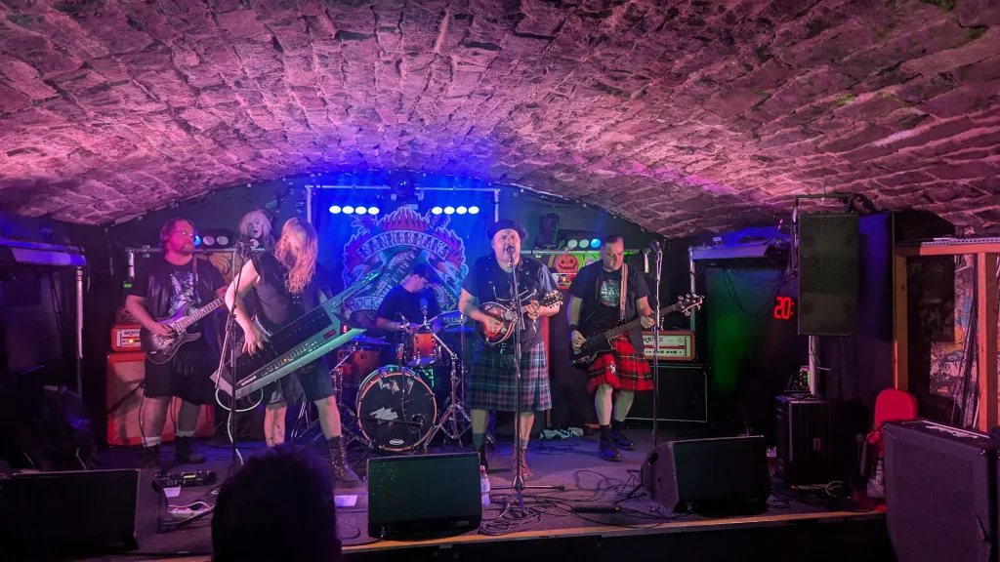
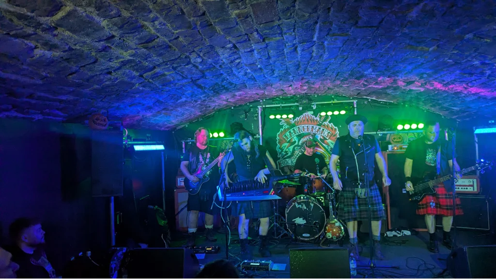
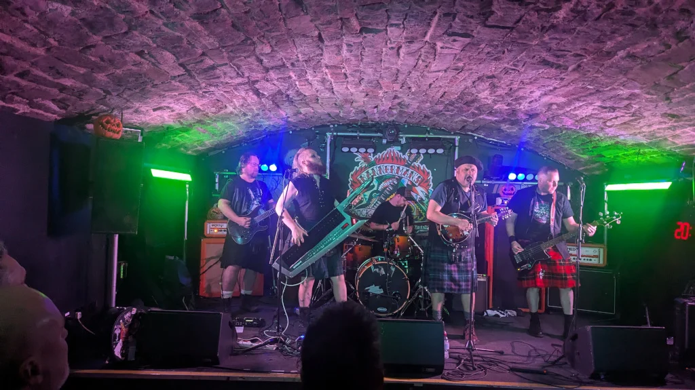
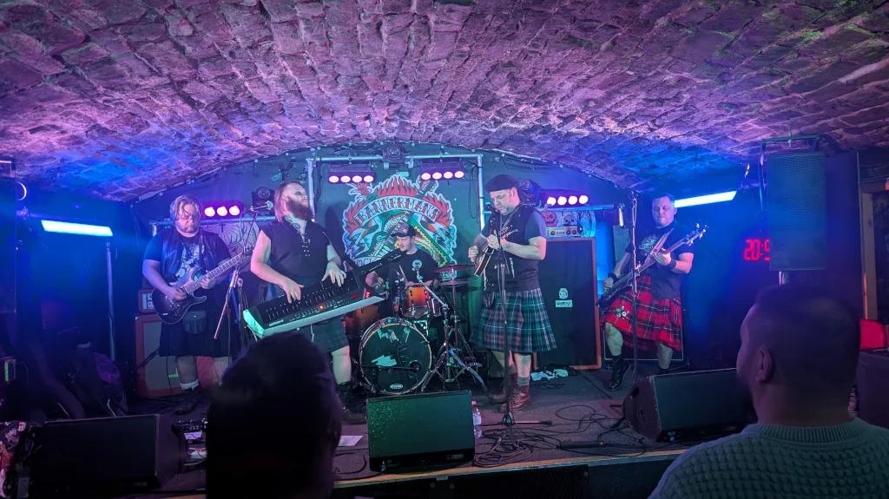
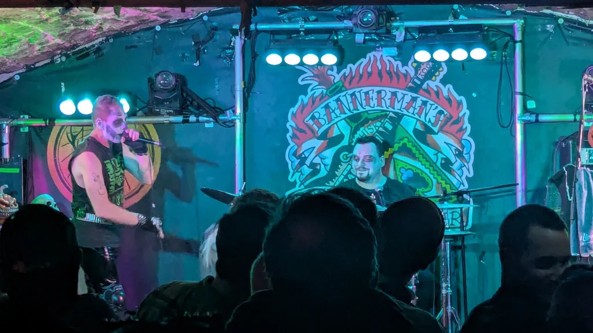
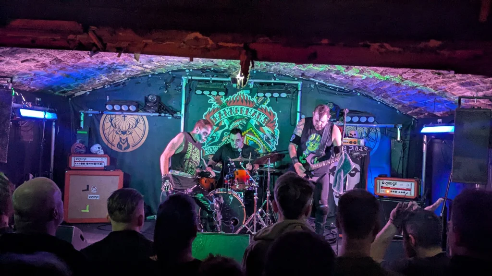
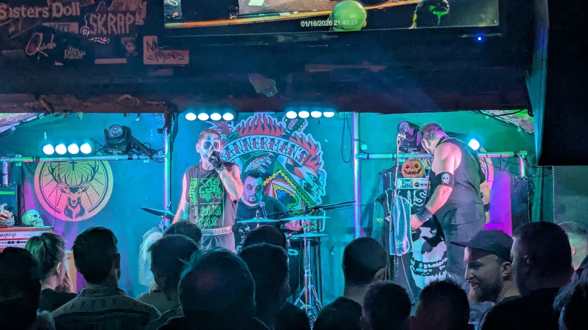
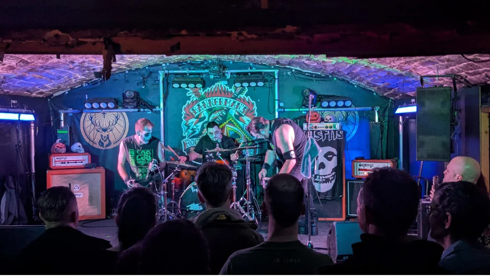

I finished work before 5:00 and popped down to The City Cafe, my usual food stop before a gig in Bannerman’s (I’m very much a creature of habit), and waited for young [Danny – GigAntics](https://www.gig-antics.live) to arrive.

For me, this is my first gig of the year and although it’s a covers band, I still love seeing live music and catching up with friends, for Danny, this would be his second, as he’s a more hardcore gig aficionado than myself.

## The Gig

The Venue - [Bannermans Bar](https://www.bannermanslive.co.uk/)

## The Bands

### A Murder of Crows

Not having heard them before I didn’t know what to expect, but as it turned out they were quite good, interesting genre “Scottish folklore Punk”, I’m always up for a bit of punk on a Friday night.

### Scary Monsters (Misfits Tribute)

I thought they were pretty good, they played some classic Misfits songs, most of which even I knew, which is good going, as I’m not a massive Misfits fan (I do like there early stuff). The only fly in the ointment for me, was the lack of a bass player, no doubt there’s a reason? But we would only be guessing at this point.

### Danny’s thoughts

> 2nd gig of the year at Bannermans last night with Billy Dickson. A bit of horror punk with Misfits tribute, the Famous Monsters and some dark Scottish folklore punk from A Murder of Crows. Brilliant night until the end of the gig when you find the bar rammed with hundreds of teenage yah students (with as many queuing outside to get in) who've just just discovered a new cool bar. WTAF!? Time for an addition to the door sign "no football colours, no tracksuits, no neds'', and no viral tiktok mobs!

## Gig Photos

### A Murder Of Crows

_A Murder Of Crows_

_A Murder Of Crows_

_A Murder Of Crows_

_A Murder Of Crows_

### Scary Monsters

_Famous Monsters_

_Famous Monsters_

_Famous Monsters_

_Famous Monsters_

## References

- Facebook - [A Murder of Crows](https://www.facebook.com/ClanCraw)
- Facebook - [Famous Monsters](https://www.facebook.com/famousmonstersuk/)
- A Murder of Crows - A review of their EP [Gouls, Gaels and Gaols (2024)](https://londoncelticpunks.wordpress.com/2024/11/24/a-murder-of-crows-ghouls-gaels-gaols/)
