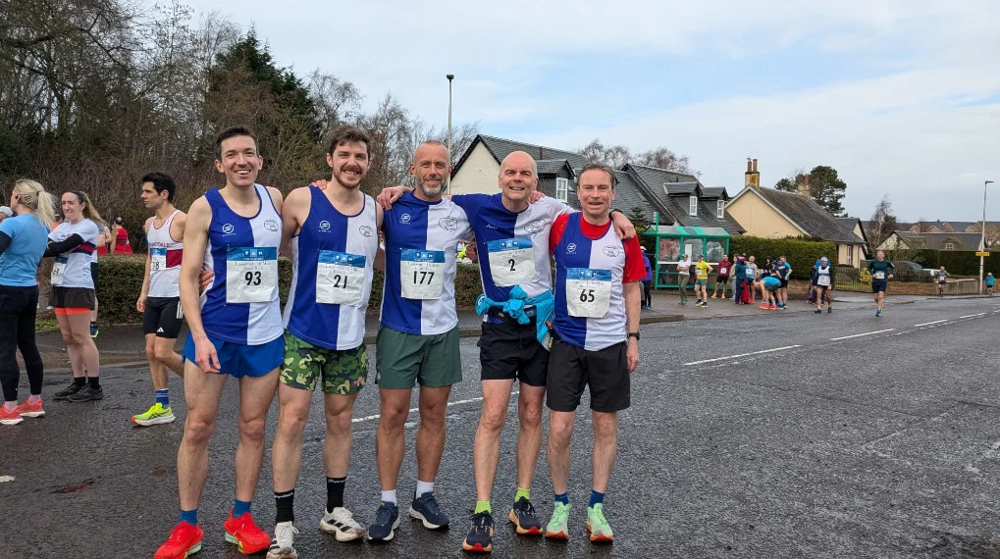
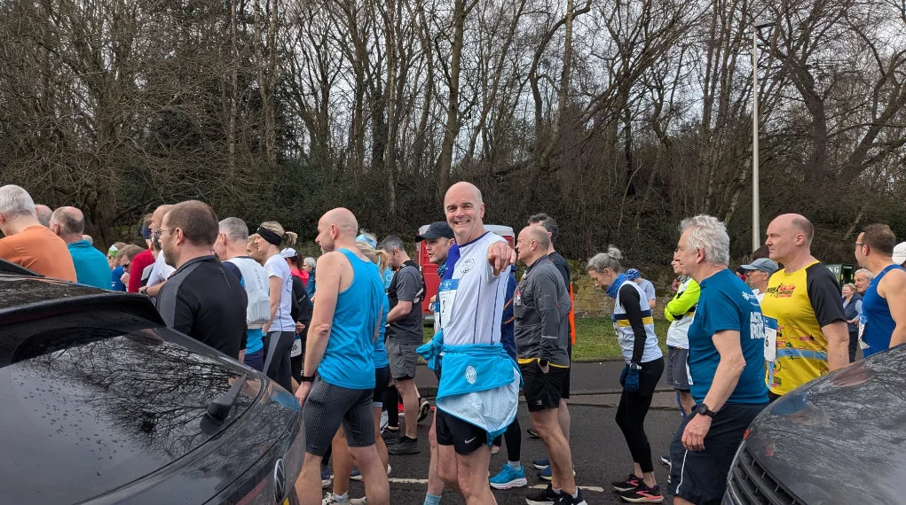

I ran this race a couple of year ago with Yvonne O'Malley and other and loved it, this year I went in a bit less prepared as life got in the way somewhat (New Kitchen, DIY and bad weather) so I couldn't do any of the long runs. My legs certainly didn't thank me for it after mile 6.

Saying that, the weather was perfect for running (nice and cool), and there was lots of running friends, as well as encouragement along the way, which I certainly needed later in the race.

Big shout out to [Lasswade Althletic Club](https://www.scottishathletics.org.uk/club/lasswade-athletics-club/) for organising such a fab race.

| Results | Place   | Name              |  Time    |  Category |
|---------|---------|-------------------|--------- |-----------|
|         | 158th   | Billy Dickson     | 01:41:00 |  M50      |

## Photos of the day

_Group Photo_

_Starting Photo_

## References

* [Run ABC Web](https://runabc.co.uk/lasswade-10-mile-road-run) Results
