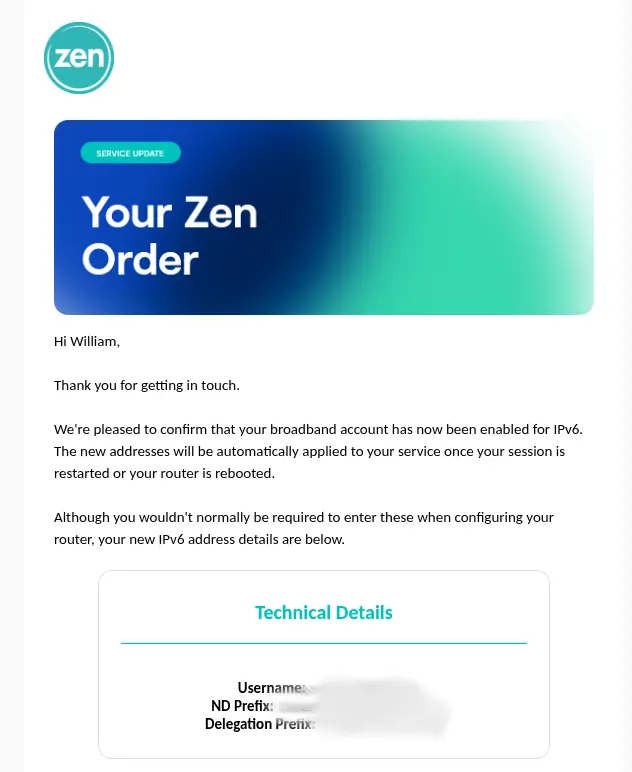
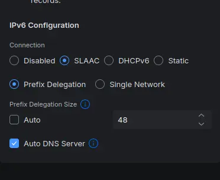
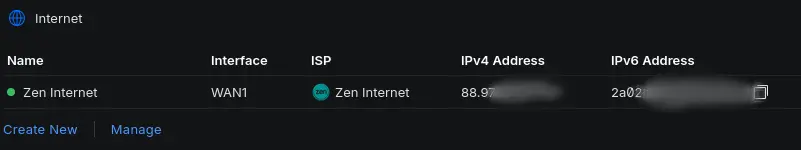
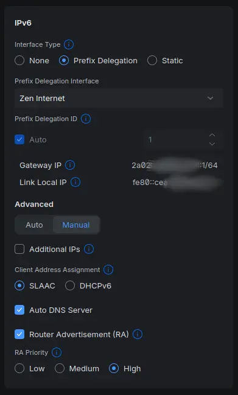
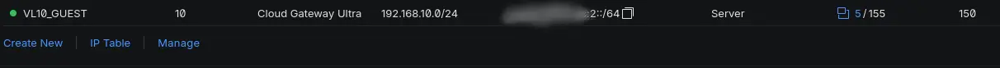

Ahead of international IPv6 day on June 6th (Yes I know I'm very early, but I had a bit of time over the weekend 😃), I thought I would setup my home internet to support it IPv6. Thankfully my ISP supports IPv6 naitively, so if you happen to use Zen Internet here in the UK, do feel free to following the instructions below.

## Prerequisites

1. A router that supports IPv6, If you use the router supplied by Zen the [FRITZ!Box 7530 AX (Wi-Fi 6) router](https://www.zen.co.uk/hardware/fritzbox/), then you should be good to go. Personally, I've been using the UniFi Cloud Gateway Ultra for a number of months now, so these instructions will only apply to UniFi Gateways, running network version 10.1.89 or later.
2. Your password and login and password for the [Zen Portal](https://my-portal.zen.co.uk/), you'll need this to request IPv6 on your line.

## Zen Intenet Setup

1. Follow Zen Internet's instructions [on this page](https://www.zen.co.uk/help-support/does-zen-provide-ipv6-support/) to start the allocation process.
2. You'll receive an email from them when the process is complete, similar to this one.

## Unifi Gateway Setup

Unifi Gateway Wan setting below.

After you've set this up (see graphic below), you're Wan Gateway should get an IPv6 address, if not you may have to reboot your Unfi Gateway.

## Unifi Lan Setup

Interface Settings below.

Afer you've set this up (see graphic below, you Lan Address should be getting an IPv6 address.

## References

- World [IPv6 Day](https://www.worldipv6launch.org/)
- Test your [IPv6 connectivity](https://test-ipv6.com/)
- IPv6 / IPv4 [Connectivity Test](https://test-ipv6.com/)
- Test my [IPv6](http://testmyipv6.com/)
