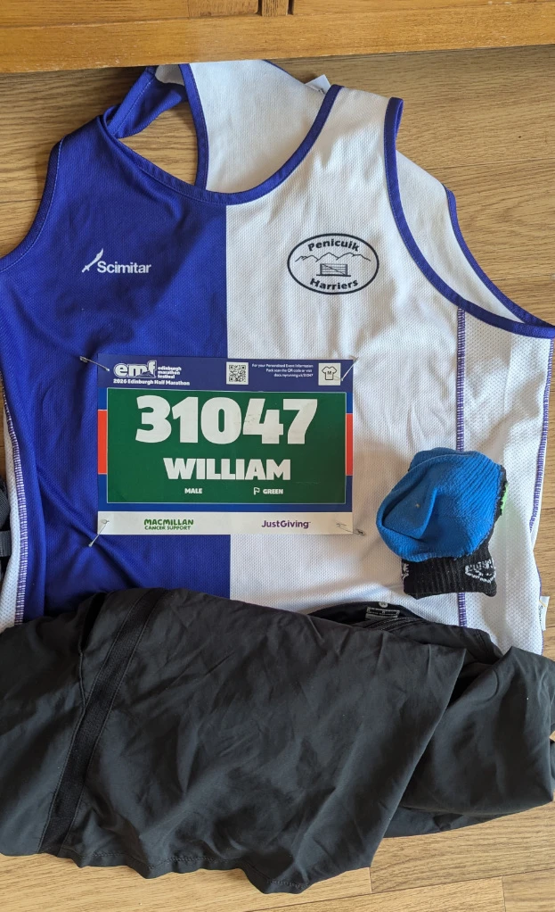
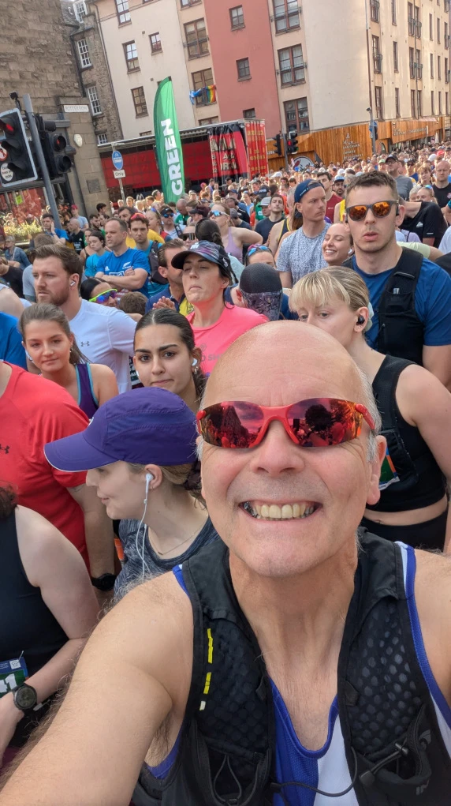
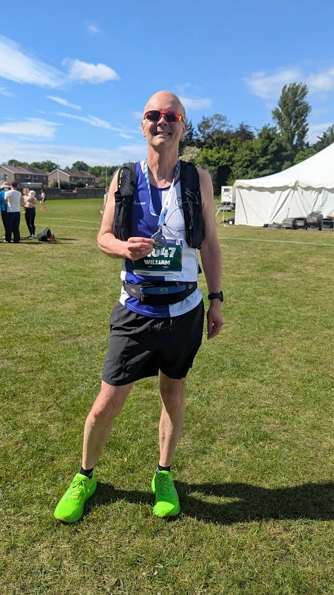

My training for the race went well and I managed to get some consistent training in during the 12 weeks run up to the race, unfortunately, it didn’t map to a good finishing time, I definitely have to remind myself that I’m getting slower and give myself some more realistic goals. 😃

Apart from having to get up and some godawful time in the morning 5:30 am, I really enjoyed the Edinburgh Half Marathon this year, It was a surprisingly hot day (global warming I suspect), the temperature reached a balmy 18 to 22 °C. I also bumped into some of my running buddies on the Bus to Edinburgh, and it was nice to catch up and chew the fat.

The whole vibe of the run was great, the only fly in the ointment being the 4 runners I ran past, who where on the grass verges getting attention for heat stroke and other ailments.

## Event Photos

_Kit Shakedown_
_Starting Line Photo_
_Finish Line Photo_

## References

- Edinburgh Marathon [Website](https://www.edinburghmarathon.com/)
