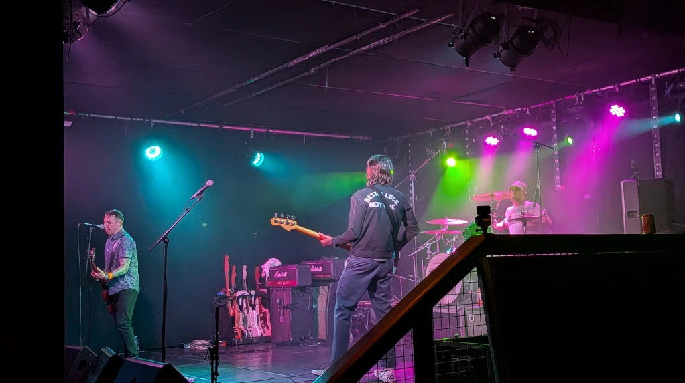
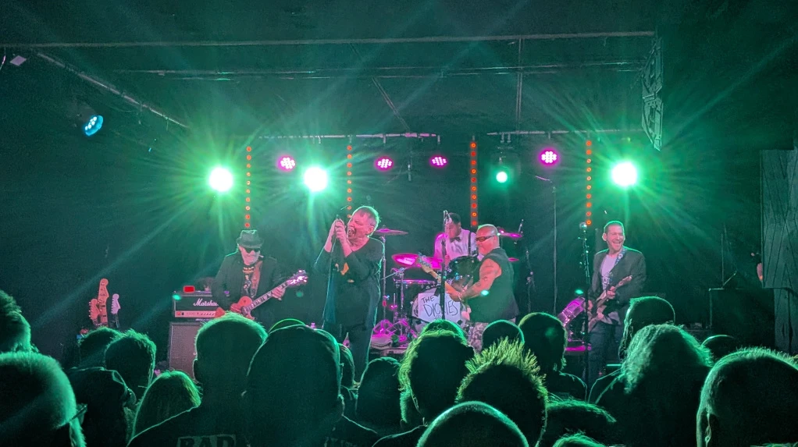
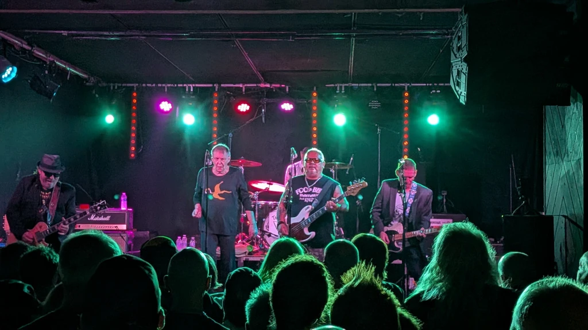
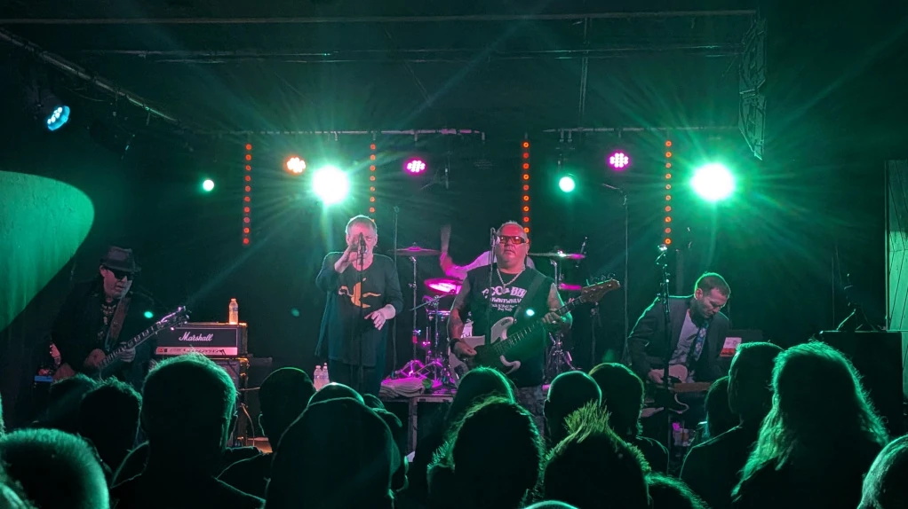
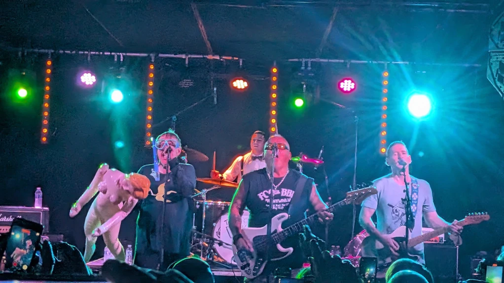
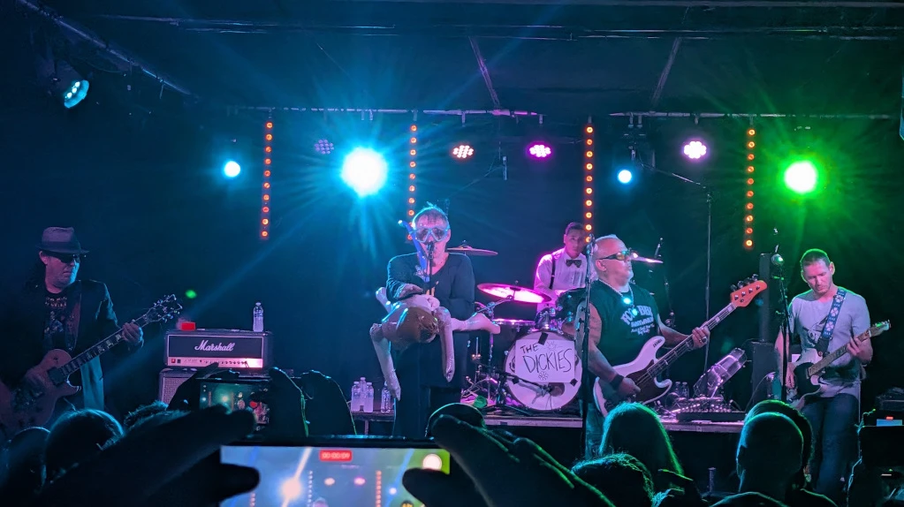
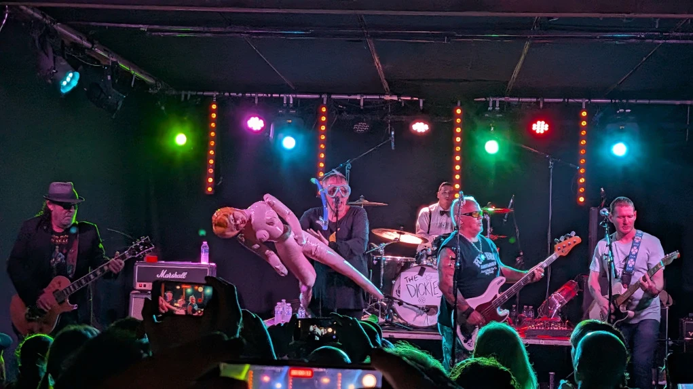

Being a Sunday and having already been out/out on the Friday for a work do (Marks retirement), I arranged to meet up with Chris for a quick pint at [Bannerman's](https://www.bannermanslive.co.uk/) prior to going to the gig (not wanting to drink too much and enjoy the band). After a beer (Cider in my case) we headed to the main event.

Venue - [La Belle Angel](http://www.la-belleangele.com/)

Me and Chris had already arranged to meet up with Lee-Anne, Ritchie, Rus, Joe and Eleanor and later by Marcus after his epic training run in the [Pentlands](https://www.pentlandhills.org/).

After the gig, we popped back to Bannerman's for a chat and a catchup (always good to see how everyone is getting on).

## The Support Bands

We managed to see Slackrr, The Eddies and Monkie Mind and enjoyed all 3, they did remind me of Blink 183, which isn't a bad thing in my book.

1. Buzzbomb [Facebook](https://www.facebook.com/buzzbombuk/?locale=en_GB)
2. Slackrr [Website](https://slackrrofficial.com/)
3. The Eddies [Facebook](https://www.facebook.com/p/The-Eddies-100063752342140/?locale=en_GB)
4. Monkie Mind [Website](https://www.wipeoutmusic.com/roster/monkey-mind/)

I didn't take that many photos (scared in case I dropped my new phone), but here's one of Monkie Mind.

_Monkie Mind_

## The Dickies

The Dickies are an American punk rock band formed in the San Fernando Valley, Los Angeles, in 1977. One of the longest tenured punk rock bands, they have been in continuous existence for over 40 years. They have consistently balanced catchy melodies, harmony vocals, and pop song structures, with a speedy punk guitar attack. This musical approach is paired with a humorous style and has been labelled "pop-punk" or "bubble-gum punk". The band have sometimes been referred to as "the clown princes of punk".

* The Dickies [Wikipedia Page](https://en.wikipedia.org/wiki/The_Dickies)

## Photos of the night

_The Dickies_
_The Dickies_
_The Dickies_
_The Dickies_
_The Dickies_
_The Dickies_
