## Introduction

TrueNAS SCALE/Community Edition include the ability obtain a trusted TLS certificate from Let's Encrypt and keep it up to date automatically. If you meet the requirements below, this is probably the easiest way to keep an up-to-date, trusted certificate for your NAS.

## Prerequisites

1. You must own or control an actual publicly registered domain. That domain doesn't need to be accessible from the public Internet, but it must have public-facing DNS records. This guide will use example.com as a placeholder for your domain.
2. The ability to add internal DNS records for your registered domain via your router, or your internal DNS setup. e.g _truenas.example.com_
3. You must host your domain's DNS at Cloudflare. Cloudflare provides free DNS hosting, among many other services (not all of which are free).
4. Your DNS provider matters because we're going to be obtaining certificates from Let's Encrypt, and that requires they validate your control over your domain.
5. TrueNAS Scale needs to be on a fairly recent version such as 25.10.7 - Goldeye, you may find that it work fine on older version, as I've not tested that, so your milage may vary.

## Instructions

### Cloudflare API Token

1. Go to [https://dash.cloudflare.com/profile/api-tokens](https://dash.cloudflare.com/profile/api-tokens)
2. Click on your domain (if you have more than one)
3. Click "Get API Token"
4. Click on "Create Custom Token"

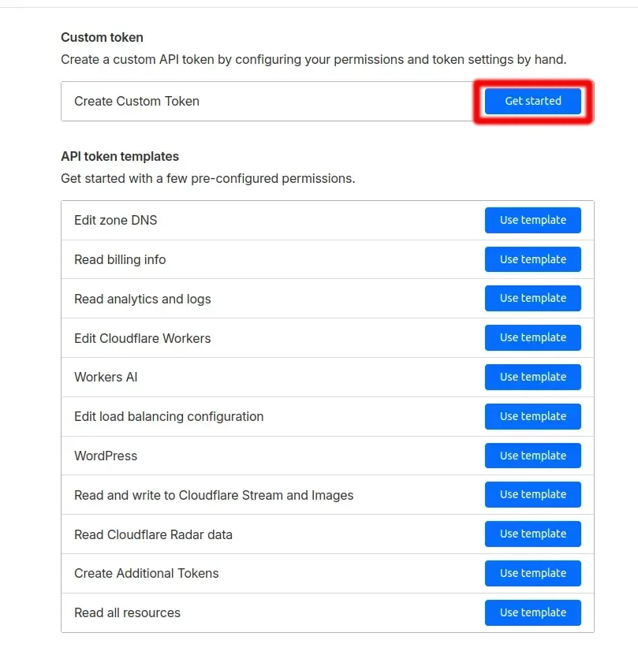
5. Set permissions

    Zone:DNS:Edit

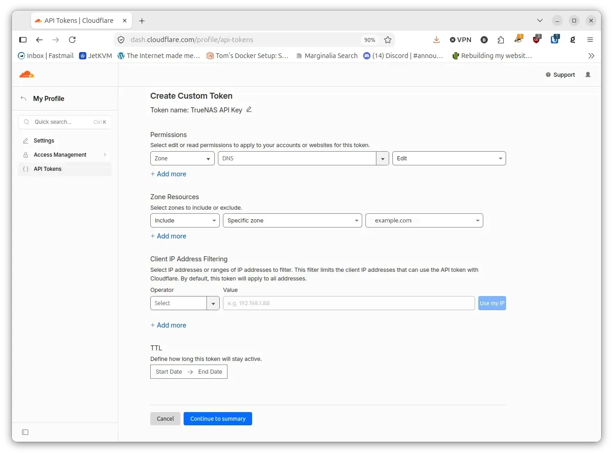

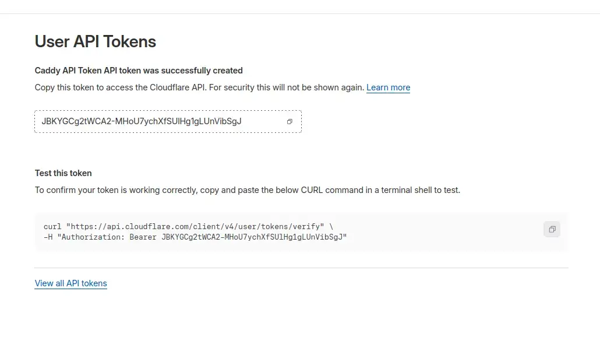

__Take a Note__ of the _Cloudflare API Token_ as you will need it later when setting up TrueNAS.

### Setting up TrueNAS

Make sure to you do the following prep on your home network.

- Ensure you've allocated a static IP address to your TrueNAS server.
- Allocate a DNS name to your TrueNAS install e.g _truenas.example.com_.

Change the general network settings (System -> Network -> Network Configuration -> Settings) on TrueNAS to reflect the setup above.
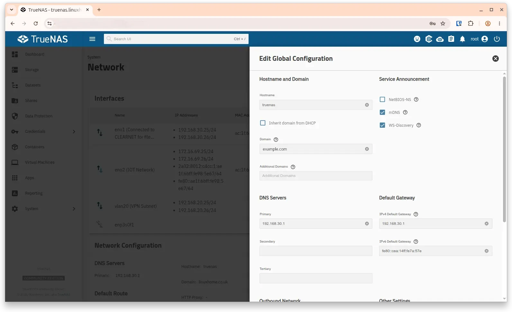

In the TrueNAS Web UI, browse to Credentials -> Certificates.
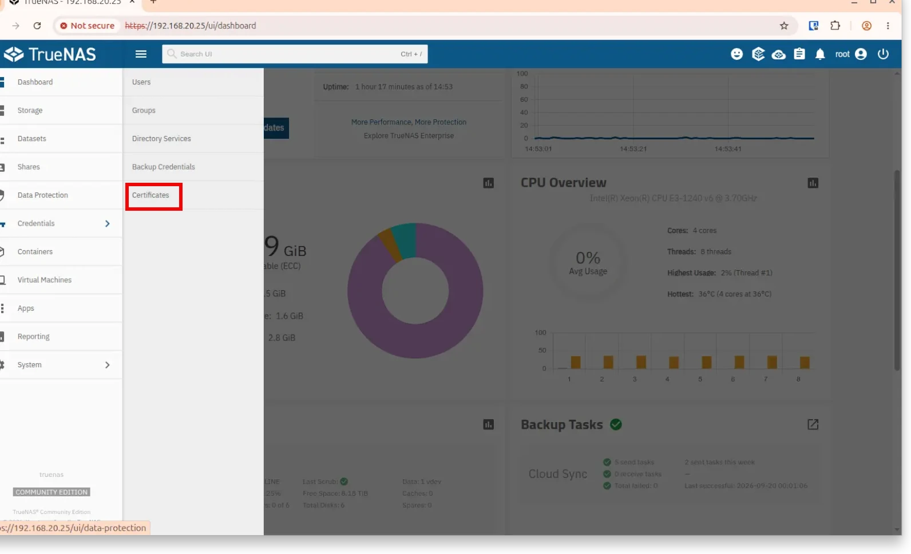

Next to ACME DNS-Authenticators, click Add.
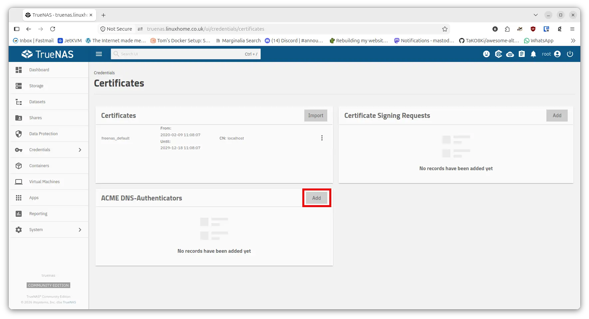

Name the authenticator as desired, and set Authenticator to match your DNS host. Then enter the required credentials, which will depend on your DNS host. For Cloudflare, enter your API Token. The token should have permissions of Zone / DNS / Edit for the domain you're requesting. The complete form will look like this.
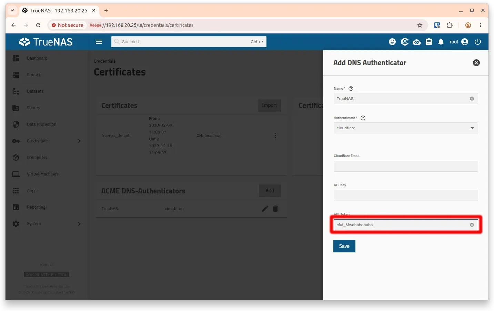
Click on Save

Next, create a CSR. Next to Certificate Signing Requests, click Add.
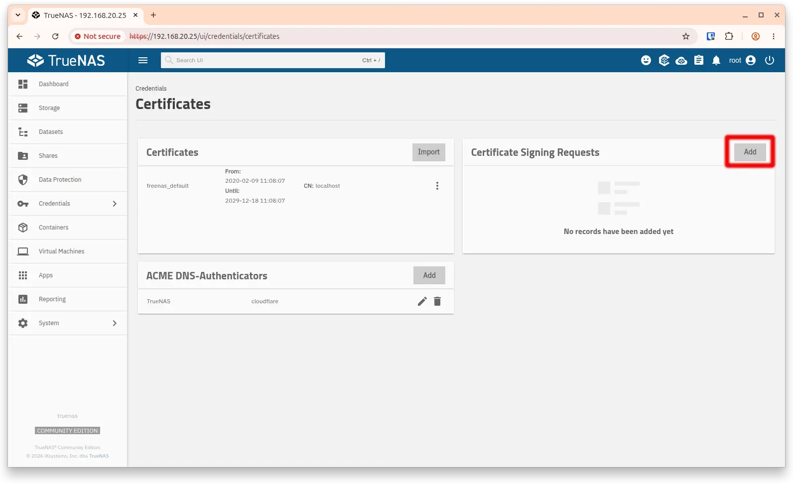

Under Identifier and Type, enter a name as desired, leave the Type set to Certificate Signing Request, and set Profile to one of the HTTPS options.

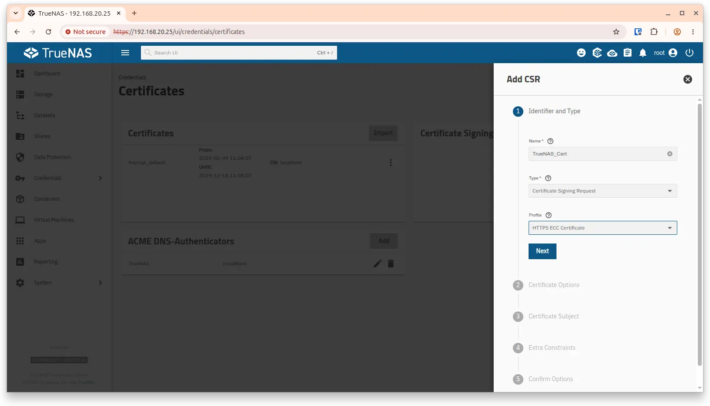

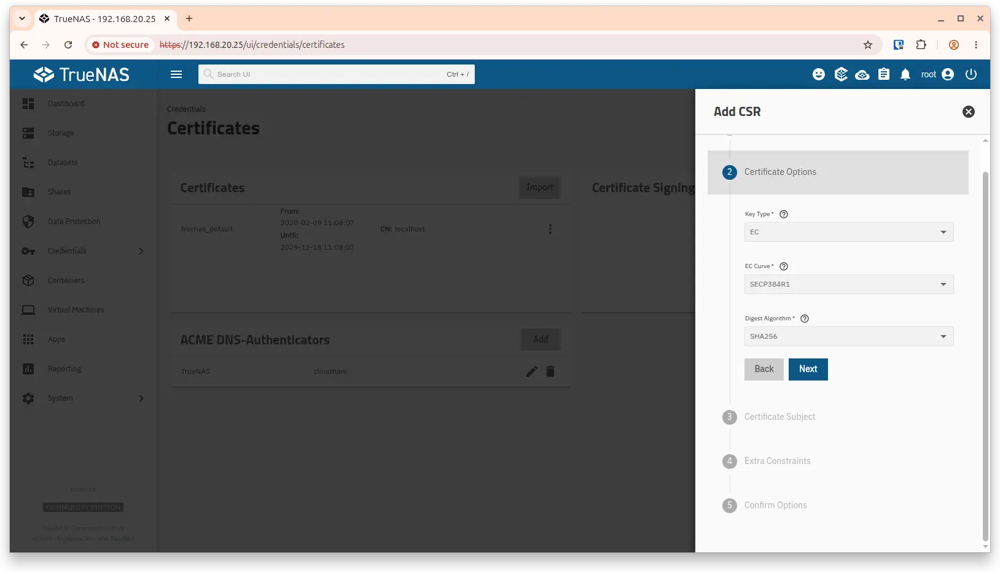

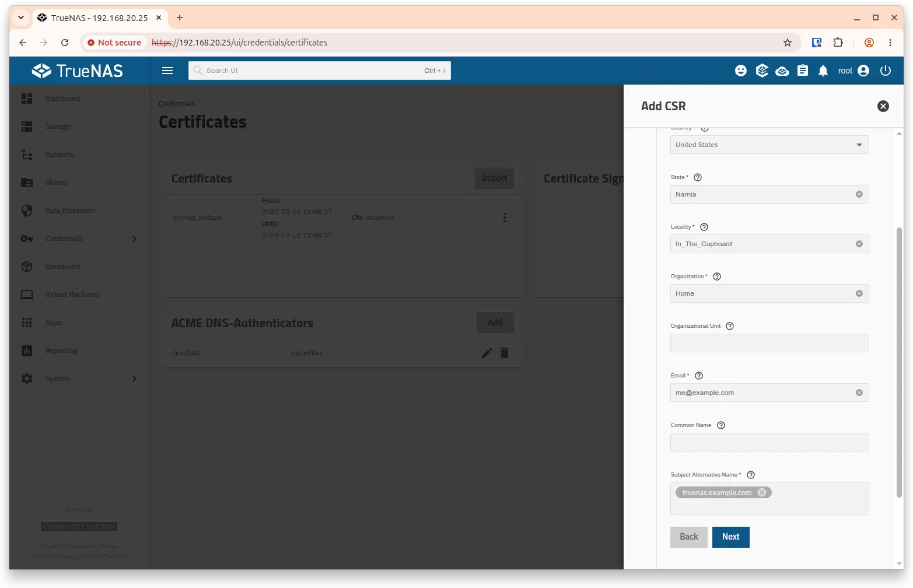

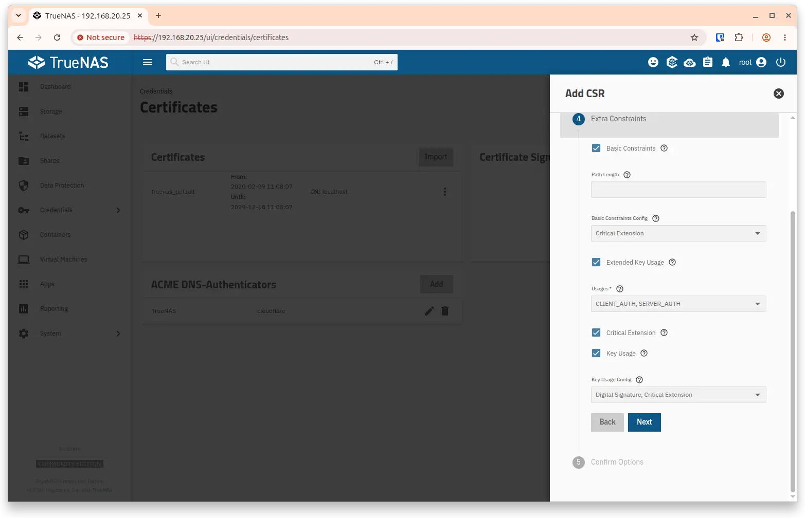

Click on __Next__, 5. Confirm Options then Save

Now we can request the certificate itself. Click on the wrench to the right of your newly-created CSR
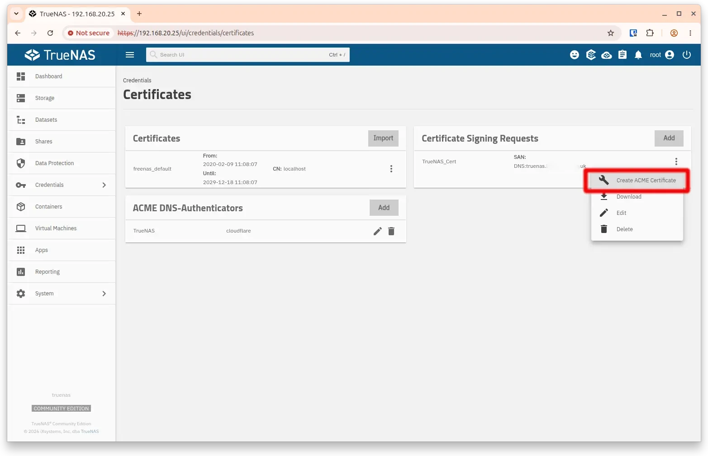

Fill in the form. Identifier can be anything you like. Check the box to accept the terms of service for your CA (Let's Encrypt's current TOS are [on their website](https://letsencrypt.org/documents/LE-SA-v1.6-August-18-2025.pdf). Set Renew Certificate Days to 30. This field controls when (i.e., how many days before expiration) TrueNAS begin trying to renew the certificate; Let's Encrypt recommends that renewal attempts begin when 1/3 of the certificate lifetime remains, which would mean 30 days.
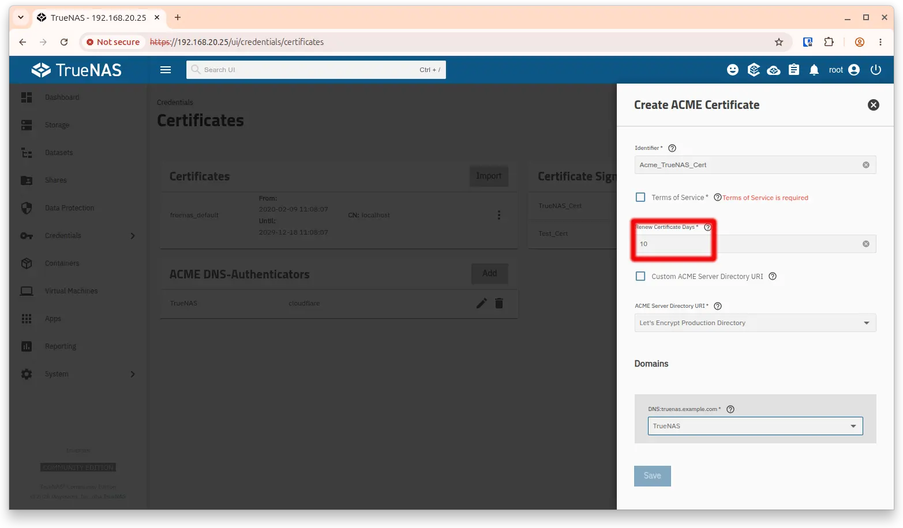
Under Domains, for each domain you've entered in the Subject Alternative Names field in the CSR, choose the ACME DNS authenticator you created above. Then click Save. Your certificate will be requested and, if successful, renewed automatically.

## Configure your system

Now that you've created the certificate, you'll need to configure your NAS to use it. Browse to System -> General Settings, and click Settings to the right of GUI.
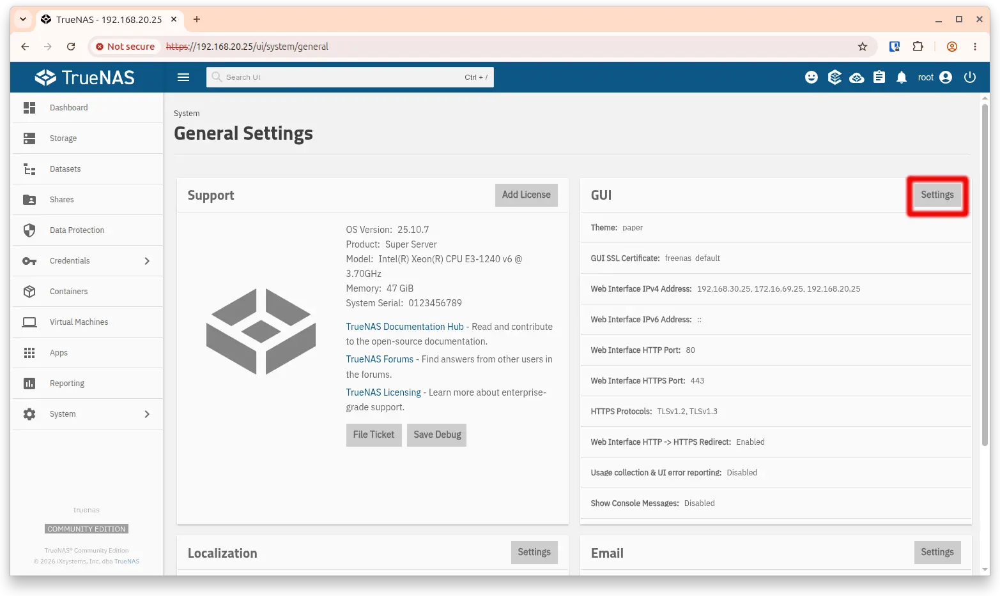

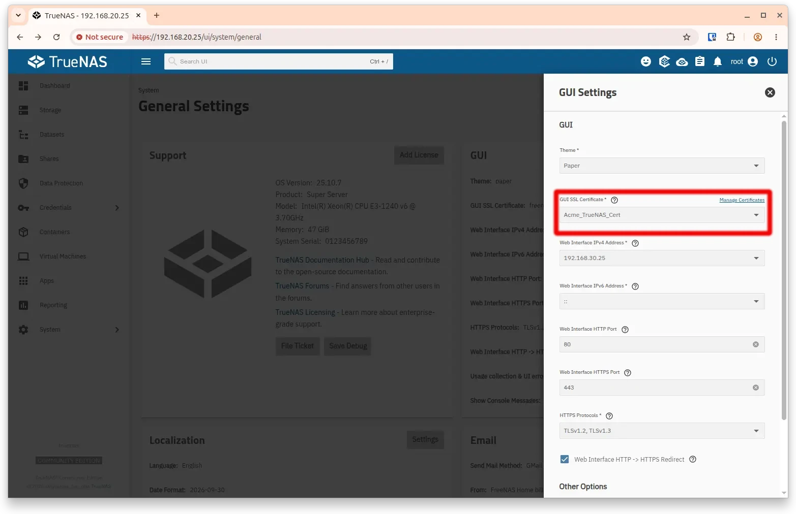

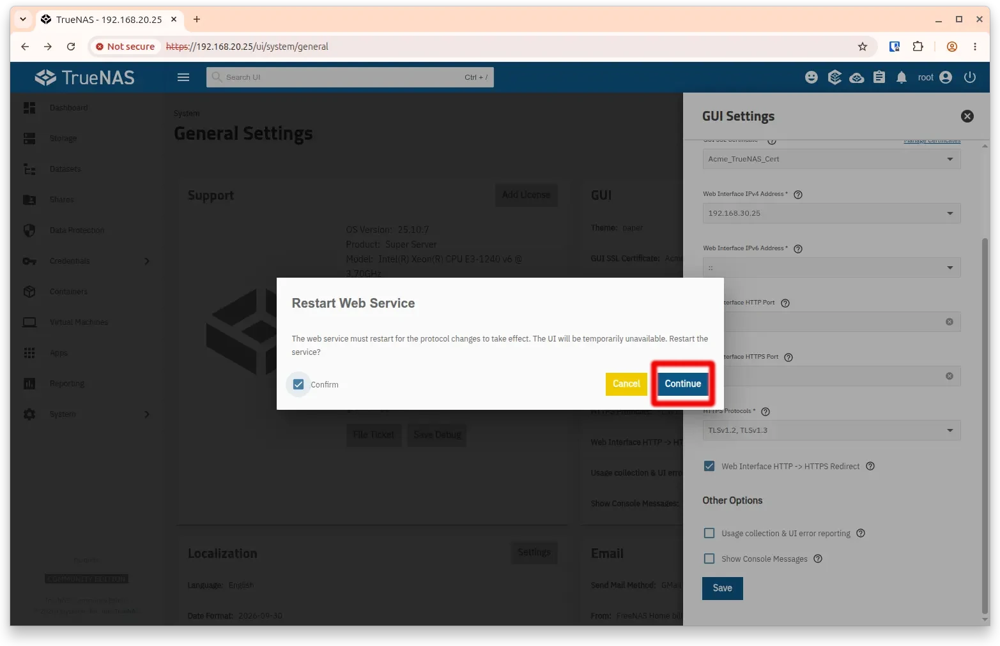

If you've configured any other services to use a certificate (FTP would be the most likely candidate), set it to use the newly-created certificate as well. Browse to System -> Services, click the pencil next to the service in question, and set the correct certificate.

Similarly, if you've configured any apps to use the previous certificate, you'll need to tell them to use the new one instead. Browse to Apps, select the app, and click Edit. Change the certificate setting to match the new one.

## References

- Dan's Wiki - [Let's Encrype Certificate for TrueNAS](https://wiki.familybrown.org/fester/maintain-truenas/letsencrypt-scale)
- TrueNAS Website - [Instructions](https://www.truenas.com/docs/scale/credentials/certificates/settingupletsencryptcertificates/)
- Lets Encrypt - [Website](https://letsencrypt.org/)
- A review of [TrueNAS 25.10 Golden Eye](https://linuxiac.com/truenas-25-10-open-source-nas-released-with-nvme-of-zfs-enhancements/)
