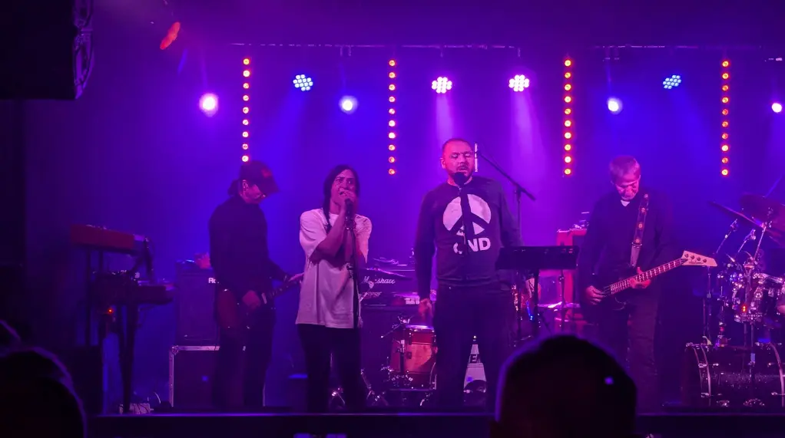
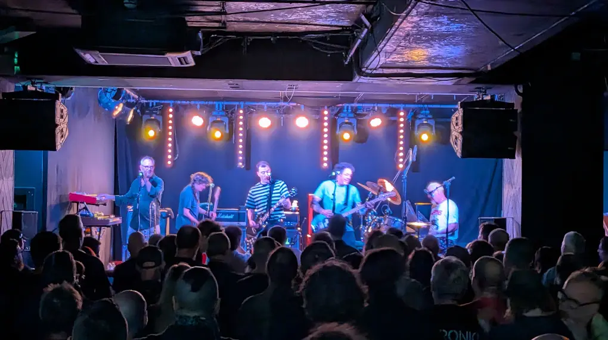
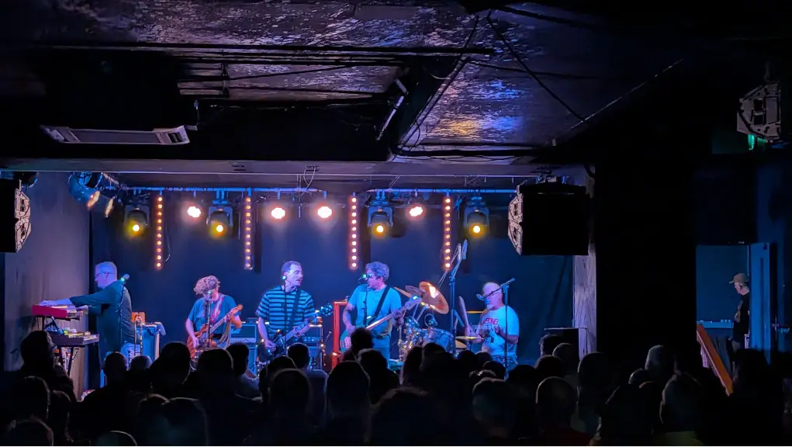

Totally unprepared for this gig, I usually spend a bit of time listening to the music for a week or so to get myself in the game, not this time, no! This time I'm going in with no idea what to expect and no pre-conceived ideas of what to expect. Saying that, I've heard a few albums from NoMeansNo back in the day (late teens).

After finishing work at my usual time, I headed out to the [City Cafe](https://www.thecitycafe.co.uk/) for some dinner and to meet up with [Danny (Gig-Antics)](https://www.gig-antics.live/). Spent a bit of time catching up and putting the world to rights as we do, Danny had other plans and was heading out to a seed talk on [The History of Punk, Goth & Alternative Fashion](https://www.eventbrite.co.uk/e/the-history-of-punk-goth-alternative-fashion-tickets-1992118950407?aff=oddtdtcreator&utm_source=fb&utm_medium=Meta_paid&utm_id=120249631853270614_v2_s02_e702_i97937590&utm_content=120249631868410614&utm_term=120249631853270614&utm_campaign=120249631852700614) which apparently was very good. If they decide to put on another one, I'm definately going to go as it's right in my wheelhouse.

I headed to the venue aiming for 7:00 to meet up with my mate Rus and his mate Joe to see the support band Gutterblood.

## The Venue

Venue - [La Belle Angel](https://la-belleangele.com/)

## The Bands

### Gutterblood

They were good, just not my cup of tea, I'm sure others were enjoying them.

_GutterBlood_

I did quite enjoy there song Gardyloo a few years ago, video below.



Below is what the t-internet says about the band.

- __Name Meaning -__ The term "gutterblood" is a Scots definition meaning a low person of inferior breeding or one of the rabble.

- __Genre -__ They mix punk, doom metal, stoner rock, indie, post-punk, and spoken word.

- __Members -__ The group features veteran musicians from the Scottish underground scene, with ties to bands like Gin Goblins, Oi Polloi, Headless Kross, and The Cosmic Dead.

- __Themes -__ Their music is a raw critique of economic inequality, systemic poverty, government corruption, and social injustice.

### Dead Bob

I really really enjoyed the music and stage performance tonight, just what a modern day punk rock gig should be, high energy, loud and politically astute and quirkey, great stuff!

- __Origin British -__ Columbia, Canada

- __Members -__ Led by [John Wright](https://en.wikipedia.org/wiki/John_Wright_(musician)) alongside multi-instrumentalists Ford Pier, Kristy-Lee Audette, Byron Slack, and Colin MacRae.

- __Sound -__ Reimagined punk rock originals and covers of tracks spanning Wright's extensive career, including material from Nomeansno and The Hanson Brothers.

- __Debut -__  Released their first album, Life Like, in November 2023



_Dead Bob_
_Dead Bob_

## References

- Bands in Town - [Dead Bob](https://www.bandsintown.com/e/108703489?app_id=ggl_feed&came_from=289)
- Dead Bob - [Website](https://deadbob.ca/)
- Dead Bob - [Spotify](https://open.spotify.com/artist/32oiLveyyvDGhgQyQJzJ3F)
- Dead Bob - [Bandcamp](https://deadbob.bandcamp.com/)
- Gutterblood - [Instagram](https://www.instagram.com/gutterbloodband/)
- Gutterblood - [Soundcloud](https://soundcloud.com/gutterblood)
- Gutterblood - [Spotify](https://open.spotify.com/artist/6J6V8ASIVVtsim1nu9dTIe)
