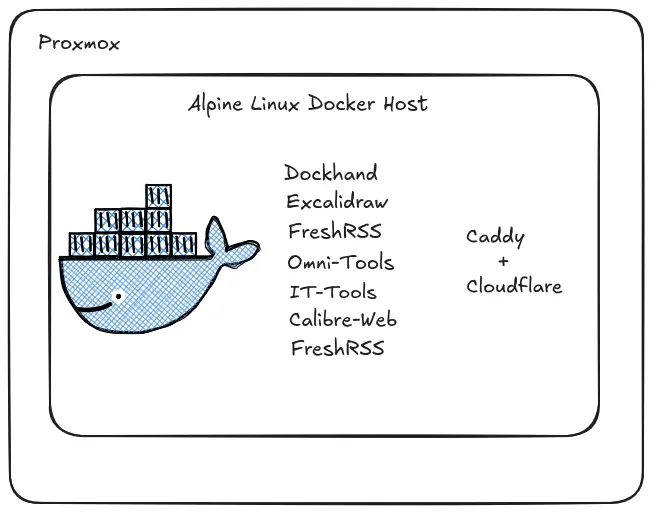
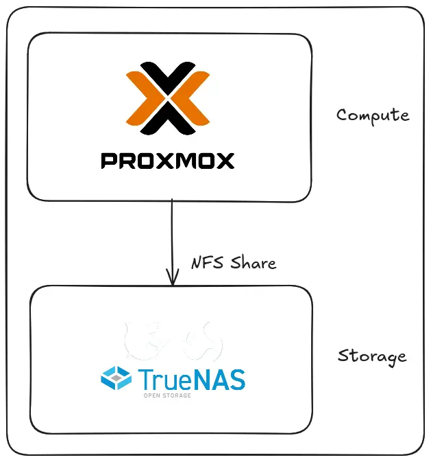

# Home Servers

1. A cheap [Home Proxmox](https://thebloody.cloud/posts/Cheap-Home-Proxmox-Server/) server for running VM's and docker containers, I don't run a lot, so there's no need for it to be powerful.
2. Home [Server](https://thebloody.cloud/posts/Current-Home-Server/) running [TruNAS Community Edition](https://www.truenas.com/) for file storage, and running Plex Media Server for Music, Movies and other bits and bobs (to be honest, I'm usually using it to stream music on the bus while I'm heading to work, or out and about at the weekend), as I currently have an android phone, this [app](https://play.google.com/store/apps/details?id=tv.plex.labs.plexamp&hl=en_GB) is what I'm currently using to stream music to my phone. Although, while I was writing this, I did come across [this](https://www.pocket-lint.com/make-your-own-music-streaming-service/) link from pocket-lint that mentioned [Subsonic](https://www.subsonic.org/pages/index.jsp) which might be something I'll look into more fully, if it all goes pear shaped with Plex. Saying that, all's good at the moment.

## Current List of Docker Containers

I thought I'd share what I'm currently running at home, in my very modest homelab. As you can already see from the graphic's below, I already use Excalidraw (great piece of software IMHO).

This is a small list of the current docker containers I'm running at home, [Caddy with Cloudflare DNS](https://thebloody.cloud/posts/Installing-Caddy-Docker-Container/) is used to supply TLS certificates for internal HTTPS. I'm using [Cloudflare tunnels](https://www.xda-developers.com/cloudflare-tunnels-gave-lab-public-url-without-opening-single-port/) with email verification for external access and [TLS termination](https://en.wikipedia.org/wiki/TLS_termination_proxy).

_Current Docker Containers_

1. [Dockhand](https://hub.docker.com/r/fnsys/dockhand/tags) for container management.
2. [Excalidraw](https://hub.docker.com/r/fnsys/dockhand/tags) An open source virtual hand-drawn style whiteboard.
3. [FreshRSS](https://github.com/FreshRSS/FreshRSS#installation) for viewing website without advertising and tracking cookies, it works great and it's one of my goto apps for reading the news and other tech website, you can check it out by following [this](https://demo.freshrss.org/) link, before you make up your mind.
4. [Omni-Tools](https://github.com/iib0011/omni-tools) a self-hosted collection of powerful web-based tools for everyday tasks. No ads, no tracking, just fast, accessible utilities right from your browser!
5. [IT-Tools](https://github.com/sharevb/it-tools/pkgs/container/it-tools) is a self-hosted collection of web-based tools for IT specific tasks, for me in my general day to day, it's been qute a handy tool.
6. [Calibre-Web](https://github.com/janeczku/calibre-web) 📚 Web app for browsing, reading and downloading eBooks stored in a Calibre database.

_Network Diagram_
